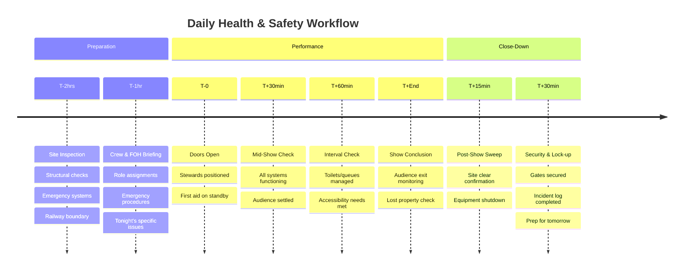
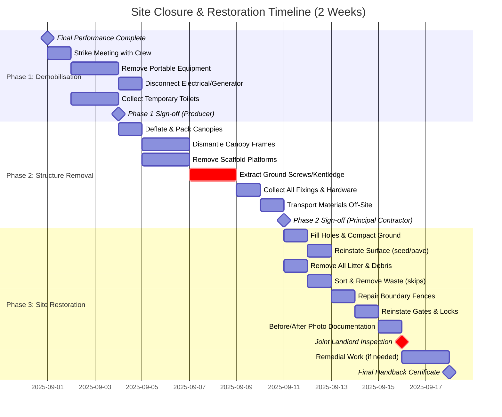
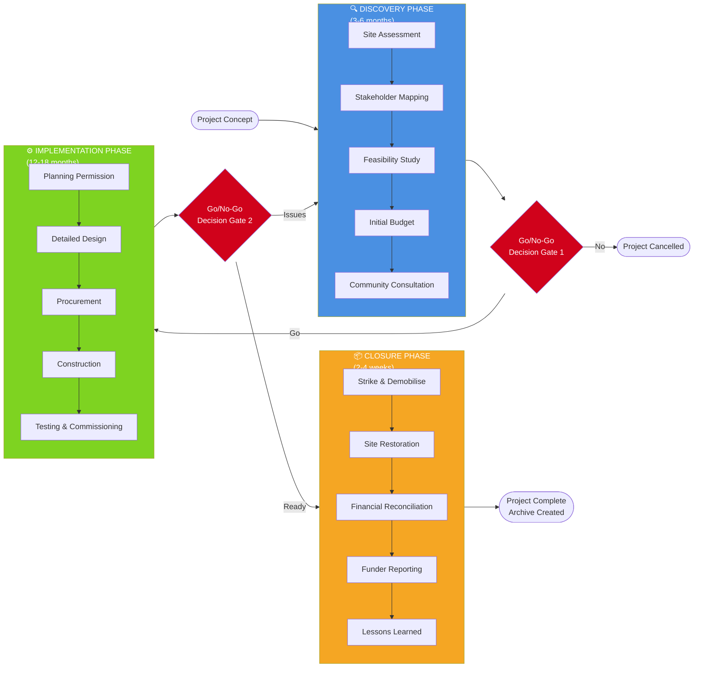
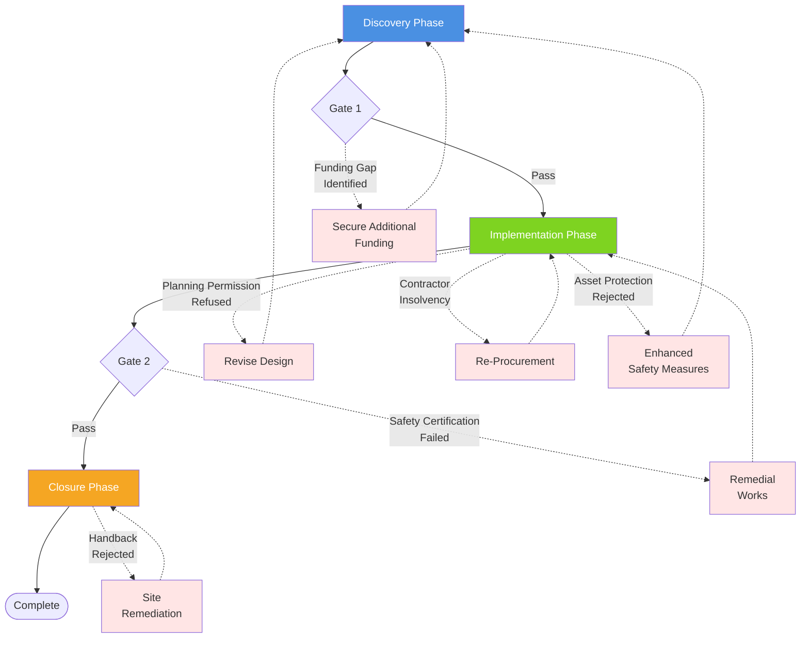

## How to Use This Manual

**Epistemic Basis:** User Experience Design (UX) and Technical Documentation Standards.

### Structure and Navigation

This manual is designed to support three distinct reading approaches:

**1. Sequential Reading (Recommended for First-Time Users)**
If you're new to venue development or beginning a project from scratch, read the manual sequentially from the [Project Delivery Framework](#project-delivery-framework) through to the [Conclusion](#conclusion). This approach builds knowledge progressively, with each section preparing you for the next.

**2. Phase-Based Navigation (For Project Teams in Execution)**
If you're already mid-project, jump directly to the relevant phase section (Discovery, Implementation, or Closure) and follow the templates and checklists provided. Cross-references will guide you to related sections as needed.

**3. Topic-Specific Reference (For Specialist Consultation)**
Use the comprehensive [Table of Contents](#table-of-contents) to navigate directly to specific topics (e.g., Asset Protection Agreements, Budget Templates, GDPR Compliance). The [Glossary](#glossary) provides quick definitions of technical terms.

### Understanding the Golden Thread

**[GOOD PRACTICE]**
Throughout this manual, you'll encounter "golden thread" commentary—narrative passages that explain *why* certain processes exist, how they connect to broader objectives, and what happens if they're overlooked. This commentary transforms the manual from a simple checklist into a strategic guide that builds your understanding of the underlying principles.

**Example:** The section on Asset Protection Agreements doesn't just list requirements—it explains why Network Rail has these requirements, how they protect public safety, and how early engagement can accelerate rather than delay your project.

### Visual Elements and Diagrams

This manual includes 13 professional diagrams created using Mermaid (interactive flowcharts and timelines) and ASCII visualisations (charts and matrices). These appear throughout the manual and are catalogued in the [Visual Elements Index](#visual-elements-index).

**Viewing Diagrams:**
- **Mermaid diagrams** render interactively in compatible Markdown viewers (VS Code, GitHub, Obsidian)
- **ASCII diagrams** display universally in any monospace font environment
- All diagrams include descriptive text for accessibility and context

**Adapting for Your Project:**
You can modify these diagrams for your own documentation:
- Copy Mermaid code and edit using [Mermaid Live Editor](https://mermaid.live)
- Recreate ASCII charts in any text editor
- Export concepts to professional diagramming tools (Lucidchart, Draw.io, Microsoft Visio)

### Templates and Checklists

The manual includes over 25 templates and checklists in the Appendices. These are:

- **Editable:** Adapt them to your specific project context
- **Print-ready:** Use as-is for daily operations
- **Funder-aligned:** Structured to meet typical reporting requirements

**[REQUIRES FORMAL EXPERT ADVICE]**
**Important:** All legal templates (MoUs, DPAs, contracts) are examples only and must be reviewed by qualified legal counsel before use.

### Internal Cross-Referencing

Hyperlinked cross-references connect related content throughout the manual. When you see a reference like "[see Appendix 13.11](#appendix-13-11)", click it to jump directly to that section. This enables efficient navigation without losing context.

### Practical Application

As you read, note sections that require immediate action and flag templates you'll need to adapt. Create a project-specific checklist drawing from the various checklists provided, tailored to your timeline and resources.

### Updates and Revisions

Check the [Version History](#version-history) periodically for updates. The manual will be revised to reflect regulatory changes, funding landscape shifts, and user feedback. Visit [www.navigategov.uk/rotherhithe-theatre-manual](https://www.navigategov.uk/rotherhithe-theatre-manual) for the latest version.

---

<div style="page-break-after: always;"></div>

<a id="disclaimer-legal-notice"></a>
## Disclaimer and Legal Notice

**Please Read This Section Carefully Before Using This Manual**

This manual provides general guidance, frameworks, and illustrative examples for developing theatre venues in complex urban environments. It is based on UK law, regulations, and sector practice as of 4 December 2025. However, it is **not** a substitute for professional advice tailored to your specific circumstances.

**1. Educational Purpose Only**

This manual is intended for educational and informational purposes. It provides a framework for understanding the processes, stakeholders, regulations, and challenges involved in venue development. It does **not** constitute:

- Legal advice (consult a qualified solicitor)
- Financial advice (consult a chartered accountant or financial adviser)
- Structural engineering advice (consult a chartered structural engineer)
- Health and safety advice (consult a competent H&S professional)
- Planning advice (consult a town planner or planning consultant)
- Medical advice (consult qualified medical professionals)
- Insurance advice (consult an insurance broker)

**2. Professional Advice Required**

Before making any significant decisions or commitments, you **must** obtain independent professional advice appropriate to your situation. This includes, but is not limited to:

- Legal review of contracts, leases, and agreements
- Structural design and certification by chartered engineers
- Financial modelling and accounting
- Health and safety risk assessment
- Planning and building control applications
- Insurance coverage assessment
- Tax implications and VAT treatment

**3. No Guarantee of Outcomes**

Following the guidance in this manual does **not** guarantee:

- Successful planning permission or regulatory approval
- Securing of funding
- Project completion within budget or timeline
- Absence of unforeseen challenges or costs
- Community support or positive stakeholder relationships
- Financial viability or artistic success

Every project is unique. Site-specific conditions, regulatory interpretations, stakeholder dynamics, market conditions, and countless other variables will affect outcomes.

**4. Regulatory and Legal Compliance**

While this manual references current UK regulations, laws, and sector guidance as of 4 December 2025, legal and regulatory frameworks change. You are responsible for:

- Verifying that information remains current
- Checking for updates to legislation, regulations, and guidance
- Ensuring compliance with all applicable laws
- Obtaining all necessary permissions, licenses, and approvals

**5. Specific Sites and Scenarios**

While this manual references specific Rotherhithe sites (Brunel Road, Lavender Pumphouse, Brunel Museum Shaft) as illustrative examples, these are used for instructional purposes. The manual does **not** constitute a feasibility study, business case, or recommendation for any specific site. If you intend to pursue any mentioned site, you must conduct your own independent due diligence.

**6. Cost and Time Estimates**

All budgets, timelines, and cost estimates provided are indicative and based on typical ranges as of 4 December 2025. Actual costs and timelines will vary significantly depending on site conditions, design choices, market conditions, contractor availability, regulatory requirements, and unforeseen circumstances. **Always obtain formal quotes and professional cost estimates** before committing to expenditure.

**7. Third-Party Information**

This manual references external organisations, legislation, guidance documents, and websites (e.g., Arts Council England, Network Rail, Southwark Council). The author and publisher are not responsible for:

- The accuracy, completeness, or currency of third-party information
- Changes to third-party websites, policies, or procedures
- Actions or omissions of third-party organisations

**8. Template Documents**

All templates provided in the appendices are examples for adaptation. They are **not** final legal documents and must be reviewed and tailored by appropriate professionals (solicitor, accountant, insurance broker, etc.) before use. Using templates without professional review may expose you to legal, financial, or operational risk.

### Limitation of Liability

To the fullest extent permitted by law, the author (Craig Cox), publisher (navigategov.uk), and any contributors or advisers involved in the preparation of this manual:

- **Disclaim all warranties**, express or implied, including warranties of accuracy, completeness, fitness for a particular purpose, or non-infringement
- **Accept no liability** for any loss, damage, cost, expense, or other consequence (including but not limited to financial loss, project failure, regulatory penalties, injury, or reputational harm) arising directly or indirectly from:
  - Use of or reliance upon this manual
  - Errors, omissions, or inaccuracies in the manual
  - Decisions made based on the manual's content
  - Failure to obtain independent professional advice
  - Changes in law, regulation, or policy occurring after publication

This exclusion applies regardless of whether the liability arises in contract, tort (including negligence), breach of statutory duty, or otherwise.

### No Professional Relationship

Reading, downloading, or using this manual does **not** create any professional advisory relationship (solicitor-client, consultant-client, or otherwise) between the reader and the author, navigategov.uk, or any contributors. If you require professional advice, you must engage appropriately qualified advisers under formal terms of engagement.

### User Responsibility

By using this manual, you acknowledge and accept that:

- You are responsible for assessing its suitability for your purposes
- You will obtain independent professional advice before acting on any information contained herein
- You understand the risks inherent in venue development projects and accept those risks
- You will verify all factual claims, cost estimates, timelines, and regulatory requirements through authoritative sources

### Jurisdiction

This disclaimer is governed by the laws of England and Wales. Any disputes arising from the use of this manual shall be subject to the exclusive jurisdiction of the courts of England and Wales.

---

<div style="page-break-after: always;"></div>

## Part One: Foundation & Framework

---

<a id="appendix-13-6-audience-survey"></a>
## Part Four: Operational Tools & Templates

### 13.6 Audience Survey Template

**[GOVERNANCE NOTE: DATA AS ASSET]**
**Audience data is your most valuable long-term asset.**
Without it, you cannot prove demand to future funders.
**Compliance:** You must have a lawful basis for collecting this data (see Appendix 13.12).

**Purpose:** Gather quantitative and qualitative feedback from audiences to support evaluation, funder reporting, and future programming decisions.

**When to Use:** Distribute surveys at the end of each performance or via email post-event. Aim for a 30-40% response rate by incentivising completion (e.g., prize draw entry).

**Key Metrics to Capture:**
- Demographic data (age, postcode, ethnicity—optional)
- How they heard about the event
- Overall satisfaction rating
- Likelihood to recommend (Net Promoter Score)
- What worked well / what could improve
- Interest in future events

**Data Protection Note:** Ensure survey includes privacy notice and GDPR-compliant data handling. See [Appendix 13.12](#appendix-13-12) for privacy notice template.

---

<a id="appendix-13-5-risk-assessment"></a>
### 13.5 Risk Assessment Framework & Register Template

**[GOVERNANCE NOTE: PROJECT INTELLIGENCE]**
**Risk assessment isn't bureaucratic box-ticking—it's your project intelligence system.**
A well-maintained risk register identifies threats early (when they're cheap to mitigate).
**Board Assurance:** The Board should review the top 5 risks at every meeting.

**Strategic Purpose: Risk Management as Project Intelligence**

Risk assessment isn't bureaucratic box-ticking—it's your project intelligence system. A well-maintained risk register identifies threats early (when they're cheap to mitigate), tracks emerging issues, and provides evidence of due diligence for funders, insurers, and the board.

**The Golden Thread:** Risks identified in Discovery inform design decisions in Implementation and operational procedures during performance runs. Your risk register is a living document that evolves with the project.

**Legal Context:**
- **CDM Regulations 2015:** Require risk assessment during design and construction
- **Health and Safety at Work Act 1974:** Employer duty to assess workplace risks
- **Management of Health and Safety at Work Regulations 1999:** Mandate written risk assessments for 5+ employees

**When to Use:**
- **Discovery Phase:** Initial risk identification and site hazard assessment
- **Implementation Phase:** Update as design develops and construction begins
- **Operations:** Daily/weekly review; immediate update after incidents
- **Closure Phase:** Final review and lessons learned documentation

---

#### Risk Assessment Methodology

**Step 1: Identify Hazards**

Systematically identify anything that could cause harm:
- **Physical hazards:** Railway proximity, working at height, confined spaces, utilities
- **Environmental hazards:** Weather, flooding, ground conditions, noise
- **Operational hazards:** Crowd management, fire, power failure, structural failure
- **Health hazards:** Dust, fumes, manual handling, stress
- **Security hazards:** Trespass, theft, vandalism, terrorism
- **Reputational hazards:** Negative media, community opposition, funder withdrawal

**Step 2: Assess Likelihood and Impact**

| Likelihood (L) | Description | Probability |
|:--------------|:------------|:-----------|
| 1 - Very Unlikely | Has never happened; extremely rare circumstances required | <5% |
| 2 - Unlikely | Could happen but uncommon; specific circumstances required | 5-25% |
| 3 - Possible | Might happen; has occurred elsewhere in similar contexts | 25-50% |
| 4 - Likely | Will probably happen; common occurrence in this type of project | 50-75% |
| 5 - Very Likely | Expected to happen; almost certain without mitigation | >75% |

| Impact (I) | Description | Consequence |
|:----------|:------------|:------------|
| 1 - Negligible | Minor inconvenience; no injury; <£500 cost | Easily absorbed |
| 2 - Minor | First aid injury; minor delay; £500-£5k cost | Manageable within contingency |
| 3 - Moderate | Medical treatment injury; significant delay; £5k-£20k cost | Requires senior management action |
| 4 - Major | Serious injury; major delay/cancellation; £20k-£100k cost | Threatens project viability |
| 5 - Catastrophic | Fatality; project failure; >£100k cost; permanent reputation damage | Project-ending consequence |

**Risk Score = Likelihood × Impact**

| Score Range | Risk Level | Response |
|:-----------:|:-----------|:---------|
| 1-5 | 🟢 **Low** | Monitor; accept risk; standard controls adequate |
| 6-12 | 🟡 **Medium** | Active management; mitigation plan required; regular review |
| 13-25 | 🔴 **High** | Urgent action; senior management oversight; may be project-critical |

---

#### Risk Register Template

**Project:** [Name]  
**Assessment Date:** [Date]  
**Assessor:** [Name, Role]  
**Review Frequency:** Weekly during operations; monthly during Discovery/Implementation  
**Next Review:** [Date]

| Risk ID | Hazard Description | L | I | Score | Risk Level | Existing Controls | Residual Risk | Additional Mitigation | Owner | Status | Review Date |
|:-------:|:-------------------|:-:|:-:|:-----:|:-----------|:------------------|:--------------|:---------------------|:------|:-------|:------------|
| R001 | Railway trespass—public access to live tracks | 3 | 5 | 15 | 🔴 High | Site fencing, signage | 🟡 Medium | 2.4m palisade fence, CCTV, steward patrols, induction briefings | Site Manager | Open | Weekly |
| R002 | Working at height—scaffold erection/strike | 4 | 4 | 16 | 🔴 High | Trained scaffolders, harnesses | 🟢 Low | Scaffold inspection cert, edge protection, exclusion zone | Principal Contractor | Open | Daily during works |
| R003 | Adverse weather—wind >40mph cancels performance | 4 | 3 | 12 | 🟡 Medium | Weather monitoring, contingency plan | 🟢 Low | Tie-down system rated 50mph, Met Office alerts, cancellation protocol | Producer | Open | Daily |
| R004 | Planning permission refused | 2 | 5 | 10 | 🟡 Medium | Pre-app consultation, professional architect | 🟢 Low | Community consultation, councillor engagement, design quality | Director | Closed (approved) | N/A |
| R005 | Contractor insolvency mid-build | 2 | 4 | 8 | 🟡 Medium | Financial vetting, staged payments | 🟢 Low | Parent company guarantee, retention clauses, alternative suppliers identified | Finance Lead | Open | Monthly |
| R006 | Insufficient ticket sales—revenue shortfall | 3 | 3 | 9 | 🟡 Medium | Marketing plan, early booking incentives | 🟡 Medium | Press campaign, partnerships with local groups, dynamic pricing | Marketing Lead | Open | Weekly |
| R007 | Fire—temporary structure highly combustible | 2 | 5 | 10 | 🟡 Medium | Fire-rated materials, extinguishers | 🟢 Low | Fire marshal, evacuation drills, hot work permits, no smoking policy | Site Manager | Open | Daily |
| R008 | Asset Protection Agreement delayed/refused | 3 | 5 | 15 | 🔴 High | Early engagement with Network Rail | 🟡 Medium | Enhanced safety design, specialist consultant, alternative site options | Director | Open | Fortnightly |
| R009 | Noise complaints—breaching licence conditions | 3 | 3 | 9 | 🟡 Medium | Acoustic assessment, sound limits | 🟢 Low | Monitoring equipment, neighbour liaison, performance scheduling | Producer | Open | Weekly |
| R010 | Audience injury—trip hazard in darkness | 3 | 4 | 12 | 🟡 Medium | Lighting, walkway markings | 🟢 Low | Increased lighting levels, steward briefing, first aider on-site | FOH Manager | Open | Daily |

**Risk Score Legend:**
- **L** = Likelihood (1-5)
- **I** = Impact (1-5)  
- **Score** = L × I
- **Residual Risk** = Risk level after existing controls applied

**Overall Project Risk Rating:** 🟡 **Medium** (manageable with controls in place)

**Red Flags (Immediate Escalation Required):**
- Any risk scoring 20-25 (very high)
- Multiple high risks (13-19) in the same category
- Residual risk still high after mitigation
- New risks emerging faster than mitigation can address

---

#### Risk Response Strategies

| Strategy | When to Use | Example |
|:---------|:------------|:--------|
| **Avoid** | Risk too high; eliminate activity | Don't build within 3m of live railway if APA impossible |
| **Reduce** | Implement controls to lower likelihood or impact | Install 2.4m fence + CCTV to reduce trespass likelihood |
| **Transfer** | Share risk with third party (insurance, contract) | Professional indemnity insurance for designer errors |
| **Accept** | Risk low enough to tolerate; monitor only | Accept minor weather-related delays as normal |

---

#### Risk Register Maintenance

**Discovery Phase:**
- Initial assessment by H&S consultant and project team
- Site walkover to identify physical hazards
- Stakeholder interviews (identify reputational/relationship risks)
- Review every 2 weeks; update as surveys/reports received

**Implementation Phase:**
- Principal Designer adds construction-specific risks
- Principal Contractor owns site safety risks
- Producer monitors schedule/budget/relationship risks  
- Review weekly at project meetings
- Update immediately after any incident or near-miss

**Operations (Performance Run):**
- Site Manager completes daily review (new risks? controls working?)
- Producer reviews weekly
- Board briefed monthly with top 5 risks
- Immediate escalation for any high-risk events

**Closure Phase:**
- Final review captures lessons learned
- Document "what worked" and "what we'd do differently"
- Archive for future projects

---

#### Risk Register Sign-Off

- **Assessor:** _______________________ **Date:** _________
- **Health & Safety Lead:** _______________________ **Date:** _________
- **Producer/Senior Manager:** _______________________ **Date:** _________
- **Board Review:** _______________________ **Date:** _________

**Next Scheduled Review:** _________

**Distribution:** Project team, H&S file, Board papers, insurer (if requested)

---

**Cross-Reference:**
- Daily H&S monitoring: [Appendix 13.9](#appendix-13-9-health-safety)
- Rail-specific risks: [Appendix 13.11](#appendix-13-11)
- Budget risk sensitivity: [Appendix 13.18](#appendix-13-18)
- Post-project evaluation: [Appendix 13.17](#appendix-13-17)

---

<a id="appendix-13-9-health-safety"></a>
### 13.9 Health & Safety Checklist for Performance Days

**[GOVERNANCE NOTE: NON-NEGOTIABLE SAFETY]**
**Safety is the only thing that can close you down instantly.**
The Site Manager has absolute authority to stop the show if safety is compromised.
**Board Duty:** The Board must be assured that this checklist is being completed *daily*.

**The Golden Thread: Safety as Non-Negotiable Foundation**

Health and safety is not bureaucratic box-ticking—it is the ethical and legal foundation upon which everything else rests. For railway-adjacent sites, this becomes even more critical. The daily operational checklist below provides a systematic framework for maintaining safety standards throughout the performance run.

**Integration Point:** This checklist should be used in conjunction with the [Risk Register (Appendix 13.5)](#appendix-13-5-risk-assessment) and the [Rail Safety Addendum (Appendix 13.11)](#appendix-13-11). Daily observations feed into weekly risk reviews.

**Accountability:** The Site Manager owns daily checklist completion; the Producer reviews and escalates urgent issues; the Board receives weekly safety summaries.

---

#### Template 12: Daily Operational Checklist

**Daily site safety checklist – [Project Name]**

- Date: ________    Weather: ________    Performance: Yes / No  
- Completed by: ________    Time: ________

**Legend:** ☐ = complete, ✗ = issue (record action required)

**Visual Reference:**

**Daily H&S Timeline (Performance Day)**



**Checkpoint Responsibilities:**

| Time | Checkpoint | Responsible Person | Critical Checks | Documentation |
|:----:|:-----------|:-------------------|:----------------|:--------------|
| **T-2hrs** | Site Inspection | Site Manager | Structures, boundaries, emergency equipment | Daily Checklist (Sec. 1) |
| **T-1hr** | Crew Briefing | Producer + Site Manager | Roles, numbers, emergency contacts | Briefing Log (Sec. 2) |
| **T-0** | Doors Open | Front of House Lead | Capacity control, accessibility | Entry Log |
| **T+30min** | Mid-Show | Duty Manager | Operations smooth, no issues | Performance Notes |
| **T+60min** | Interval | FOH + Facilities | Queues, facilities, accessibility | Interval Report |
| **T+End** | Audience Exit | Stewards + FOH | Complete departure, belongings | Exit Confirmation |
| **T+30min** | Close Down | Site Manager | Equipment off, site secure | Close-Down Checklist (Sec. 3) |

**For railway-adjacent sites, add:**
- T-2hrs: Railway boundary fence integrity check
- T+End: Track-facing lights must remain on until site secured
- T+30min: Confirm no materials left within 3m of railway boundary

---

##### Site Inspection (2 Hours Before First Performance)

**Critical Focus:** Structural integrity, emergency systems, railway boundary security.

| Item | Check | Status | Action if Issue |
| :--- | :--- | :---: | :--- |
| Fencing and boundaries | Secure, no gaps, height adequate | ☐ | |
| Gates | Functioning locks, no obstructions | ☐ | |
| Walkways | Clear of trip hazards, cables covered | ☐ | |
| Platforms | Stable, no loose boards, guardrails intact | ☐ | |
| Canopies | Tensioned correctly, no tears or damage | ☐ | |
| Lighting | All fixtures working, no exposed wiring | ☐ | |
| Sound equipment | Tested, volume appropriate, no feedback | ☐ | |
| Emergency lighting | Tested, batteries charged | ☐ | |
| Emergency exits | Clear, signage visible and illuminated | ☐ | |
| Fire extinguishers | In position, pins intact, pressure OK | ☐ | |
| First aid kit | Stocked, accessible, location known to staff | ☐ | |
| Toilets | Clean, stocked, waste removed | ☐ | |
| Generator | Fuel adequate, running smoothly, secure | ☐ | |
| Weather check | Forecast reviewed; wind speeds < 40 mph | ☐ | |
| Railway boundary | Fencing intact; no evidence of tampering | ☐ | |

##### Crew and FOH briefing (1 hour before)

| Item | Check | Status | Notes |
| --- | --- | --- | --- |
| Stewards rostered | [Number] required / [Number] present | ☐ | |
| Hi-vis worn | All FOH staff identifiable | ☐ | |
| Briefing delivered | Roles, emergency procedures, nightly issues | ☐ | |
| First aider named | Name ________  Location ________ | ☐ | |
| Contact numbers shared | All staff have Site Manager mobile | ☐ | |
| Capacity reminder | Max audience 60; overspill protocol confirmed | ☐ | |

##### Performance monitoring (during show)

| Time | Check | Notes |
| --- | --- | --- |
| 30 min into show | All areas functioning; audience settled | |
| 60 min / interval | Toilets, queues, accessibility needs reviewed | |
| End of show | Audience exit clear; no belongings left | |

##### Post-show close down

| Item | Check | Status | Action |
| --- | --- | --- | --- |
| Audience departed | Site clear | ☐ | |
| Equipment shut down | Lights, sound, generator powered off/secured | ☐ | |
| Gates locked | Site secure overnight | ☐ | |
| Lost property logged | Items stored safely | ☐ | |
| Litter removed | Bins emptied if full | ☐ | |
| Prep for tomorrow | Outstanding tasks noted | ☐ | |

##### Incidents / near misses
Record accidents, injuries, near-misses, or audience complaints.  
Time: ________  Description: ______________________________  
Action taken: ______________________________  
Reported to: ________  Follow-up required: Yes / No

##### Weather / other notes
[Observations relevant to tomorrow’s operations]

##### If the incident involves the railway or critical rail asset (rail adjacent sites)
**[CRITICAL SAFETY PROTOCOL]**
- Immediately stop all works and secure the scene.
- Notify Network Rail Asset Protection and TfL Property immediately (see contact matrix for phone numbers).
- If there is any possibility of track or asset damage or tampering, inform the site control point and the emergency services per Network Rail guidance.
- Log the incident in the incident register and flag for immediate H&S review; do not re-open site activities until Asset Protection confirms it is safe.
- Example rapid contacts: Network Rail Asset Protection (03457 11 41 41), TfL Property (property@tfl.gov.uk).

____________________________________________________

##### Sign-off
- Checklist completed by: ________  Time: ________
- Site Manager review: ________  Time: ________
- Urgent issues requiring immediate attention? Yes / No  
   If yes, describe: __________________________________

See toolkit/hs-daily-checklist-print.md for a downloadable/printable H&S daily checklist.

---

<a id="appendix-13-8-funder-report"></a>
### 13.8 Funder Report Template

**Strategic Context: Funders as Partners, Not Just Paymasters**

**[GOOD PRACTICE]**
Funder reporting is often seen as an administrative burden. Reframe it: this is your opportunity to demonstrate impact, build trust, and strengthen relationships for future applications. A well-crafted funder report tells your project's story with evidence, honesty, and learning.

**The Golden Thread:** Effective funder reporting connects what you promised (application), what you delivered (outputs), what you learned (evaluation), and what comes next (sustainability). Each section below serves this narrative arc.

**Customisation Guidance:** Tailor the depth of each section to the grant value and any bespoke reporting clauses in your funding agreement. Small grants (£5k-£20k) may require 3-5 pages; major grants (£100k+) may require 20-30 pages with appendices.

**Cross-Reference:** Use data from the [Audience Survey (13.6)](#appendix-13-6-audience-survey), [Risk Register (13.5)](#appendix-13-5-risk-assessment), [Budget Template (13.18)](#appendix-13-18), and [Partnership Log (13.19)](#appendix-13-19) to populate this report efficiently.

---

#### Template Structure

##### Cover Information
- Organisation name, project name, grant reference
- Recipient (funder name) and reporting period
- Submission date and primary contact (name, email, phone)

##### Executive Summary (one page)
- Brief project overview
- Key achievements
- Headline challenges and mitigation
- Outcomes and impact snapshot
- Financial topline (income vs expenditure)

##### Section 1 – Project Delivery
[Summary of what was delivered vs what was promised]

##### Section 2 – Programme & Deliverables

**Programme Overview:**
Provide a comprehensive overview of the programme delivered against the original project schedule. Highlight any changes to timing, scope, or delivery methods, and explain the strategic or operational reasons for these adjustments.

**Deliverables Breakdown:**
List what was delivered with specific metrics:
- Number of performances (vs. planned)
- Audience numbers (total and per performance)
- Community workshops or engagement sessions
- Physical infrastructure created
- Digital outputs (if applicable)
- Partnership activations

**Comparison to Planned Milestones:**
Use a simple table to show planned vs. actual delivery:

| Deliverable | Planned | Actual | Variance | Explanation |
|:------------|:--------|:-------|:---------|:------------|
| Performances | 12 | 14 | +2 | Additional dates added due to demand |
| Audience | 720 | 840 | +120 | Higher capacity achieved |
| Workshops | 6 | 5 | -1 | Facilitator illness; rescheduled to next phase |
- Timings: a short narrative and a table showing original vs actual dates for key milestones (Discovery completion; planning consent; temporary works installation; first performance; closure).


##### Section 3 – Community Engagement & Participation
- Summary of community engagement undertaken (events, workshops, leaflets, consultation submissions) and outcomes.
- Community benefits delivered (local hires, reduced ticket prices, free performances, space usage) and number of local beneficiaries.
- Key partners and local groups engaged; any formal agreements or MoUs.
- Any concerns raised and how they were addressed; lessons learned for future community engagement.

##### Section 4 – Evaluation and Learning
###### 4.1 What Worked Well
- [Successes to replicate]

###### 4.2 What Was Challenging
- [Honest reflection: What was harder than expected?]

###### 4.3 How We Responded
- [Adaptations made during project]

See toolkit/funder-report-template-full.md for a downloadable funder report template and example structure.

###### 4.4 Lessons for Future
- [What would we do differently?]
- [Recommendations for others attempting similar projects]

##### Section 5 – Financial Report

**The Golden Thread: Financial Transparency Builds Trust**

**[GOOD PRACTICE]**
Funders need to see that their investment was managed prudently. Present variances honestly with clear explanations. Significant underspend can be as concerning as overspend—both suggest planning gaps.

**Budget Performance Comparison (Visual)**

```
EXPENDITURE CATEGORY          BUDGETED vs ACTUAL          VARIANCE
═══════════════════════════════════════════════════════════════════════

Structural Works           ████████████░░░░ (-15%)      🟢 UNDER
£25,000 budget            ████████████ £21,250 actual

Professional Fees          ████████████████ (+8%)       🟡 ON TARGET
£12,000 budget            █████████████ £12,960 actual

Temporary Power            ████████░░░░░░░░ (-32%)      🟢 UNDER
£4,000 budget             █████ £2,720 actual

Canopies & Structure       ████████████████░░ (+12%)    🔴 OVER
£12,000 budget            █████████████░ £13,440 actual

Acoustic & Equipment       ████████████████ (+6%)       🟡 ON TARGET
£10,000 budget            ██████████░ £10,600 actual

Steward & Licensing        ████████░░░░░░░░ (-24%)      🟢 UNDER
£6,000 budget             ██████ £4,560 actual

Contingency (15%)          ████████████████ (48% used)  🟢 ADEQUATE
£10,350 budget            ████████ £4,968 used

─────────────────────────────────────────────────────────────────────
TOTAL PROJECT              ████████████████ (-2%)       🟢 ON BUDGET
£79,350 budget            ███████████████ £77,498 actual

█ = £1,000    ░ = Variance    🟢 = Good    🟡 = Acceptable    🔴 = Concern
```

**Variance Analysis Summary:**

| Category | Budget | Actual | Variance | % | Status | Explanation |
|:---------|-------:|-------:|---------:|--:|:------:|:------------|
| Structural Works | £25,000 | £21,250 | -£3,750 | -15% | 🟢 | Ground conditions better than expected |
| Professional Fees | £12,000 | £12,960 | +£960 | +8% | 🟡 | Additional H&S consultancy |
| Temporary Power | £4,000 | £2,720 | -£1,280 | -32% | 🟢 | Solar option cheaper than generator |
| Canopies & Structure | £12,000 | £13,440 | +£1,440 | +12% | 🔴 | Weather-rated spec upgrade required |
| Acoustic & Equipment | £10,000 | £10,600 | +£600 | +6% | 🟡 | Additional microphones for accessibility |
| Steward & Licensing | £6,000 | £4,560 | -£1,440 | -24% | 🟢 | Volunteer uptake exceeded forecast |
| **Subtotal** | **£69,000** | **£65,530** | **-£3,470** | **-5%** | 🟢 | **Within contingency** |
| Contingency Used | £10,350 | £4,968 | -£5,382 | -52% | 🟢 | Good risk management |
| **TOTAL** | **£79,350** | **£70,498** | **-£8,852** | **-11%** | 🟢 | **Project under budget** |

**Funder Reporting Note:** This favorable variance demonstrates prudent financial management and allows surplus to be allocated to enhanced programming or returned to funder as per grant agreement terms.

###### 5.1 Income

**Table Structure:** Show budgeted vs. actual income by source, with variance column and narrative notes.

| Income Source | Budgeted (£) | Actual (£) | Variance (£) | Variance % | Notes |
| :--- | ---: | ---: | ---: | ---: | :--- |
| [Grant name] | £X | £X | £X | |
| Ticket sales | £X | £X | £X | [Explain variance] |
| [etc.] | | | | |
| **TOTAL** | **£X** | **£X** | **£X** | |

###### 5.2 Expenditure

**Table Structure:** Show budgeted vs. actual expenditure by category, with variance analysis.

| Expenditure Category | Budgeted (£) | Actual (£) | Variance (£) | Variance % | Notes |
| :--- | ---: | ---: | ---: | ---: | :--- |
| Artist fees | £X | £X | £X | |
| Construction | £X | £X | £X | [Explain variance] |
| [etc.] | | | | |
| **TOTAL** | **£X** | **£X** | **£X** | |

###### 5.3 Explanation of Variances
[Paragraph explaining any significant over/underspends]

###### 5.4 Final Position
- Surplus/deficit: £[amount]
- [If surplus: How will it be used?]
- [If deficit: How was it covered?]

###### 5.5 Audit
[If required: "Accounts have been independently audited by [Auditor Name]. Audit report attached."]

##### Section 6 – Outputs and Evidence
###### 6.1 Publicity and Media Coverage
- Press articles: [number]; estimated reach: [number]
- Broadcast: [list TV/radio coverage]
- Social media: [followers gained; engagement metrics]
- Marketing materials: [attach samples]

###### 6.2 Programme and Evaluation Data
- [Attach performance programme]
- [Attach audience survey summary]
- [Attach photos (selection of 10-15 high-quality images)]

###### 6.4 Partnerships & In-kind Contributions
- Provide a short table listing partner organisations, type of contribution (in-kind, volunteer hours, sponsorship), and an estimated monetary value for in-kind support for funder transparency.
- List any formal MoUs or SLAs and confirmation of community co-creation activities.

###### 6.3 Supporting Letters/Testimonials
- [Attach letters from partners, community leaders, audience members]

*Accessibility & Compliance Evidence*
- Include a short accessibility report (summary of adaptations made, accessible seating numbers and any quality assurance from local access groups) as part of outputs.
- Include a data protection statement demonstrating GDPR compliance (privacy notice, DPA with ticketing provider, retention schedules) where ticketing data is used as part of program evaluation.

##### Section 7 – Acknowledgment and Thanks
We are deeply grateful to [Funder Name] for making this project possible. Your support has enabled [specific impact]. We have acknowledged your support in all publicity materials and on our website.

[Include logos and credit lines used]

##### Section 8 – Next Steps
[What happens now? Is the project continuing? Is the organisation pursuing other work?]

##### Appendices to Report
- A. Financial Statements (detailed accounts)
- B. Audience Survey Data (full results)
- C. Risk Register (final version)
- D. Safeguarding and Health & Safety Records (summary)
- E. Board Approval (minutes confirming acceptance of this report)

##### Declaration
I confirm that the information in this report is accurate and complete.

- Signed: __________________
- Name: [Name]
- Position: [Chair of Board / Senior Manager]
- Date: ________

Organisation Registered Address:
[Address]
Charity/Company Number: [Number]

---

<a id="appendix-13-10-closure-handback"></a>
### 13.10 Closure and Handback Checklist

**The Golden Thread: Ending Well Secures Future Opportunities**

**[GOOD PRACTICE]**
How you leave a site matters as much as how you arrive. A professional, complete handback:
- Protects your reputation for future projects
- Secures your deposit/financial guarantee
- Maintains relationships with landowners and regulators
- Provides evidence for funder reporting
- Demonstrates environmental responsibility

**Success Indicator:** Handback certificate issued without remedial work requests and positive feedback from landowner.

**Integration Point:** Cross-reference with [Discovery Phase site photos](#discovery-phase), [Risk Register final version](#appendix-13-5-risk-assessment), and [Funder Report Section 4](#appendix-13-8-funder-report).

---

#### Template 13: Site Restoration and Handback Checklist

**Site Demount & Handback Process Flow**



**Critical Path Activities** (delays to these impact handback date):
- Ground screw extraction (specialist equipment required)
- Surface reinstatement (weather-dependent)
- Landlord inspection scheduling (requires 1 week notice)

**Sign-off Requirements:**

| Phase | Sign-off Required | Documents Needed | Approval Criteria |
|:------|:------------------|:-----------------|:------------------|
| **Phase 1 Complete** | Producer | Equipment inventory reconciliation<br/>Services disconnection certificates | All removable items off-site<br/>No utilities active |
| **Phase 2 Complete** | Principal Contractor | Structural removal completion cert<br/>Waste transfer notes<br/>Transport manifests | All installed works removed<br/>Materials accounted for |
| **Phase 3 Complete** | Landlord (TfL/Network Rail/Other) | Before/after photos<br/>Environmental check report<br/>Boundary restoration evidence | Site restored to original condition<br/>No contamination<br/>All access returned |

**Contingency Planning:**
- Weather delays: Build 3-day buffer into Week 2
- Inspection rejection: Pre-arrange contractor availability for remedial work
- Waste disposal: Book skip collection with 48hr flexibility

**Project Details:**

- Project name: ________  
- Completion date: ________

##### Phase 1 – Demobilisation (week 1)
- [ ] Final performance completed (date ________)
- [ ] Strike meeting held with all crew
- [ ] Equipment inventory reconciled
- [ ] Portable kit removed (lighting, sound, furniture, props)
- [ ] Electrical supply isolated / generator removed or powered down safely
- [ ] Temporary services disconnected (toilets serviced and collected)

##### Phase 2 – Structure removal (weeks 1–2)
- [ ] Canopies deflated/packed
- [ ] Canopy frames disassembled
- [ ] Scaffold platforms dismantled and components sorted
- [ ] Foundations removed (ground screws extracted or kentledge lifted)
- [ ] All fixings and hardware collected
- [ ] Materials transported off-site

##### Phase 3 – Site restoration (week 2)
- [ ] Holes filled and compacted
- [ ] Surface reinstated (re-seeded, re-paved, or equivalent)
- [ ] Litter/debris removed; all areas swept clean
- [ ] Waste sorted (recyclable / general / hazardous) with skips booked
- [ ] Waste transfer notes obtained
- [ ] Boundary fences repaired; bollards/signage reinstated
- [ ] Gates returned to original condition; landlord locks reinstated

##### Phase 4 – Environmental checks
- [ ] No evidence of fuel or material contamination
- [ ] Drainage inspected; gullies clear
- [ ] Trees/vegetation undamaged
- [ ] Ground compaction relieved (aerate/topsoil as required)

##### Phase 5 – Documentation
- [ ] “Before” photos retrieved from Discovery phase
- [ ] “After” photos captured and filed
- [ ] Comparison sheet prepared for funders/landlord
- [ ] Statutory inspection records collated (scaffold, H&S)
- [ ] Utility disconnections confirmed in writing
- [ ] All keys/access fobs returned
- [ ] Final waste disposal records filed

##### Phase 6 – Landlord inspection
- [ ] TfL/landowner notified (minimum one week’s notice)
- [ ] Joint inspection conducted (date ________, attendees ________)
- [ ] Deficiencies documented with action plan
- [ ] Remedial works completed and re-inspected if needed
- [ ] Handback certificate or written confirmation received and filed

##### Phase 7 – Final administration
- [ ] Final contractor invoices paid
- [ ] Utility accounts closed
- [ ] Insurance policy updated or cancelled
- [ ] Financial reconciliation completed
- [ ] Funder reports drafted/submitted
- [ ] Thank-you notes issued to partners
- [ ] Internal lessons-learned session completed
- [ ] Digital archive created and backed up; physical materials stored or donated
- [ ] Board notified of successful closure

##### Certification
I confirm that the site has been restored to the required standard and all handback requirements have been met.

- Site Manager: __________________  Date: ________
- Producer: ______________________  Date: ________
- Landlord representative (TfL Property / Network Rail / Other): __________________  Date: ________

Comments:  
____________________________________________________  
____________________________________________________

Final status: □ Site successfully handed back

Outstanding items (if any):  
____________________________________________________

---

<a id="conclusion"></a>
## Conclusion

### Final Thoughts for the Theatre Director

**You've Reached the End—But This Is Just the Beginning**

**[INFERRED JUDGEMENT]**
If you've read this far, you now possess something rare: a comprehensive understanding of what it truly takes to create a theatre venue in one of the UK's most challenging urban environments. This knowledge transforms aspiration into achievable reality.

**The Eight Pillars of Success**

Creating a temporary theatre project—especially on challenging sites like railway-adjacent land—requires mastery of eight interconnected disciplines:

1. **Rigorous planning** – no shortcuts; every permission, every survey, every stakeholder matters.
2. **Patience** – regulatory processes take longer than you hope; build buffers.
3. **Flexibility** – you'll face surprises; adapt without compromising safety or vision.
4. **Partnerships** – no one succeeds alone; invest in relationships.
5. **Financial realism** – costs always exceed first estimates; model conservatively.
6. **Community focus** – this is for Rotherhithe; keep local benefit at the centre.
7. **Professional support** – hire experts (engineers, lawyers, consultants); it's false economy to DIY everything.
8. **Artistic courage** – don't lose sight of why you're doing this; let creativity lead.

### Partnerships and Practical Local Engagement
**[GOOD PRACTICE]**
Forming practical, local partnerships is a high-leverage activity: it reduces cost, builds audience and trust, and creates operational resilience. Use Appendix 13.19 (Collaborations & Partnerships Playbook) and Appendix 13.20 (Procurement) during Discovery to map partners, create quick MoUs, and as evidence of community support for funders.


### Your Project is Viable If:
- You have 18-24 months lead time (12 months minimum for Brunel Road; 36+ months for Pumphouse).
- You can secure £100k-£150k for the Brunel Road temporary project (or £2m-£4m for the Pumphouse permanent venue).
- You have strong artistic vision that responds to site constraints.
- You're willing to engage the community authentically (not just consultation box-ticking).
- You can build a skilled, committed team (even if small).
- You have organisational resilience (CIC structure, competent governance).

### Your Project is Not Viable If:
- You're in a hurry (these things cannot be rushed).
- You're unwilling to invest in professional advice.
- You see the community as an obstacle rather than a partner.
- You lack a funding pipeline (grants take 6-12 months; you need bridge funding).
- You cannot comply with safety requirements (non-negotiable near railway).

### Next Steps After Reading This Manual

#### If pursuing Brunel Road:
1. Land Registry search (Week 1).
2. Contact TfL Property and Network Rail (Week 1).
3. Site reconnaissance (Week 2).
4. Southwark pre-app enquiry (Weeks 3-4).
5. Decision point: proceed to Discovery Phase? (Week 6).

Refer to Appendix 13.14 (Director's 30/90 Day Action Playbook) and Appendix 13.11 (Rail Safety Addendum) for immediate tasks and templates.

**Brunel Road: Immediate rail-safety tasks (first 6 weeks)**
- Confirm the rail boundary and map references with Network Rail Asset Protection.
- Commission a GPR and structural survey before intrusive groundworks (Week 2–4).
- Appoint Principal Designer with rail experience; ensure Asset Protection is engaged prior to any temporary works (Week 3–5).

#### If pursuing Pumphouse:
1. Identify building owner; initiate contact (Week 1).
2. Commission building surveys (Months 1-2).
3. Community consultation (Month 2).
4. Feasibility study (capital costs, operating model) (Months 2-3).
5. Decision point: proceed to capital fundraising? (Month 4).

#### If pursuing Brunel Shaft:
1. Approach Brunel Museum (Week 1).
2. MoU negotiation (Month 1).
3. Programming and business case (Month 2).
4. Decision point: pilot season or full commitment? (Month 3).

### Resources and Support

**Strategic Partnerships: Your Extended Team**

The organisations listed below are not just service providers—they are potential partners in your project's success. Building relationships with sector bodies, funders, and professional networks creates resilience and opens doors to knowledge, funding, and collaborative opportunities.

**Resource & Support Ecosystem Map**

```mermaid
graph TD
    Project[YOUR THEATRE<br/>PROJECT] 
    
    %% Funding Cluster
    Project -->|£ Grants| ACE[Arts Council<br/>England]
    Project -->|£ Capital| NLHF[National Lottery<br/>Heritage Fund]
    Project -->|£ Development| AHF[Architectural<br/>Heritage Fund]
    Project -->|£ Local| Southwark[Southwark<br/>Cultural Grants]
    Project -->|£ Community| Crowdfund[Community<br/>Shares/Crowdfunding]
    
    %% Regulatory Cluster
    Project -->|⚖️ Permissions| Planning[Southwark<br/>Planning]
    Project -->|⚖️ Building| BC[Building<br/>Control]
    Project -->|⚖️ Rail Safety| NR[Network Rail<br/>Asset Protection]
    Project -->|⚖️ Land| TfL[TfL<br/>Property]
    Project -->|⚖️ Licensing| License[Licensing<br/>Authority]
    Project -->|⚖️ H&S| HSE[Health &<br/>Safety Executive]
    
    %% Professional Network Cluster
    Project -->|🤝 Advocacy| ITC[Independent<br/>Theatre Council]
    Project -->|🤝 Buildings| Trust[Theatres<br/>Trust]
    Project -->|🤝 Sector| SOLT[SOLT /<br/>UK Theatre]
    Project -->|🤝 Design| RIBA[RIBA /<br/>Architects]
    Project -->|🤝 Engineering| IStructE[IStructE /<br/>Engineers]
    Project -->|🤝 Legal| Lawyers[Charity Law<br/>Specialists]
    
    %% Community Cluster
    Project -->|👥 Partnership| RothForum[Rotherhithe<br/>Forum]
    Project -->|👥 Heritage| Brunel[Brunel<br/>Museum]
    Project -->|👥 Business| LocalBiz[Local<br/>Businesses]
    Project -->|👥 Volunteers| Volunteers[Volunteer<br/>Groups]
    Project -->|👥 Media| LocalPress[Local<br/>Press/Media]
    
    %% Reciprocal relationships
    ACE -.-> ITC
    NLHF -.-> Trust
    Trust -.-> RIBA
    RothForum -.-> Southwark
    Brunel -.-> NLHF
    LocalBiz -.-> RothForum
    
    style Project fill:#FF6B6B,stroke:#C92A2A,color:#fff
    style ACE fill:#4DABF7,stroke:#1971C2
    style NLHF fill:#4DABF7,stroke:#1971C2
    style AHF fill:#4DABF7,stroke:#1971C2
    style Southwark fill:#4DABF7,stroke:#1971C2
    style Crowdfund fill:#4DABF7,stroke:#1971C2
    style Planning fill:#FFA94D,stroke:#E8590C
    style BC fill:#FFA94D,stroke:#E8590C
    style NR fill:#FFA94D,stroke:#E8590C
    style TfL fill:#FFA94D,stroke:#E8590C
    style License fill:#FFA94D,stroke:#E8590C
    style HSE fill:#FFA94D,stroke:#E8590C
    style ITC fill:#69DB7C,stroke:#2F9E44
    style Trust fill:#69DB7C,stroke:#2F9E44
    style SOLT fill:#69DB7C,stroke:#2F9E44
    style RIBA fill:#69DB7C,stroke:#2F9E44
    style IStructE fill:#69DB7C,stroke:#2F9E44
    style Lawyers fill:#69DB7C,stroke:#2F9E44
    style RothForum fill:#DA77F2,stroke:#9C36B5
    style Brunel fill:#DA77F2,stroke:#9C36B5
    style LocalBiz fill:#DA77F2,stroke:#9C36B5
    style Volunteers fill:#DA77F2,stroke:#9C36B5
    style LocalPress fill:#DA77F2,stroke:#9C36B5
```



**Ecosystem Leverage Strategies:**

**🔵 Funding Bodies (Blue)** - Layer multiple small grants rather than depending on one large funder  
**🟠 Regulatory Bodies (Orange)** - Engage early; they can become advocates when properly consulted  
**🟢 Professional Networks (Green)** - Membership provides templates, advice lines, and peer learning  
**🟪 Community Partners (Purple)** - Co-creation builds authenticity and reduces costs through in-kind support

**Network Effects:**  
Dotted lines show mutual relationships between ecosystem members. Example: Arts Council trusts ITC recommendations; Brunel Museum has NLHF credibility; Local businesses influence Rotherhithe Forum. Build relationships strategically to leverage these connections.\n

**How to Use This Section:**

**For Immediate Needs:** Jump to the Quick-Reference Matrix at the bottom for contact details organized by function.

**For Strategic Planning:** Review each category to identify potential partnerships, not just transactional relationships.

**For Funding Strategy:** Note which funders support which project aspects, and layer multiple small grants rather than relying on a single large one.

---

### Funding Bodies by Project Phase

**Discovery Phase Funding (Feasibility Studies, Surveys, Consultancy):**
- Arts Council England: Project Grants (can include development costs)
- Architectural Heritage Fund: Project Development Grants (£5k-£25k for heritage buildings)
- Local trust funds: Many support feasibility work; search [Directory of Social Change](https://www.dsc.org.uk)

**Implementation Phase Funding (Capital Costs):**
- National Lottery Heritage Fund: Heritage Capital Grants (£10k-£5m)
- Arts Council England: Capital Grants
- Section 106 Developer Contributions: Via local authority
- Community share offers: [communityshares.org.uk](https://communityshares.org.uk)

**Operational Phase Funding (Running Costs, Programming):**
- Arts Council England: National Portfolio Organisation status or Project Grants
- Southwark Cultural Grants: [culture@southwark.gov.uk](mailto:culture@southwark.gov.uk)
- Earned income: Box office, café/bar, space hire
- Sponsorship and philanthropy

**Cross-Reference:** For funder reporting requirements, see [Appendix 13.8](#appendix-13-8-funder-report). For budget planning including funding mix, see [Appendix 13.18](#appendix-13-18).

---

| Organisation | Focus | Link / Notes |
| :--- | :--- | :--- |
| Arts Council England | Funding guidance, toolkits, policy insight | [artscouncil.org.uk](https://www.artscouncil.org.uk) |
| Independent Theatre Council | Contracts, advice line, pay guidance | [itc-arts.org](https://www.itc-arts.org) |
| Theatres Trust | Theatre buildings expertise, planning support | [theatrestrust.org.uk](https://www.theatrestrust.org.uk) |
| National Lottery Heritage Fund | Capital funding for heritage-led projects | [heritagefund.org.uk](https://www.heritagefund.org.uk) |
| Architectural Heritage Fund | Loans and grants for heritage assets | [ahfund.org.uk](https://ahfund.org.uk) |
| Network Rail Asset Protection | Safety approvals for working near live railway | [networkrail.co.uk](https://www.networkrail.co.uk/running-the-railway/looking-after-the-railway/asset-protection-and-optimisation/) |
| Southwark Council | Planning, licensing, culture grants | [southwark.gov.uk](https://www.southwark.gov.uk) |
| Society of London Theatre (SOLT) | Sector advocacy, ticketing schemes | [solt.co.uk](https://solt.co.uk) |
| UK Theatre | UK-wide professional network and training | [uktheatre.org](https://www.uktheatre.org) |
| Performing Arts Venue Network | Peer learning and benchmarking | Contact via SOLT/UK Theatre member services |

`[Diagram: stakeholder ecosystem map linking funders, regulators, partners, and networks — simple radial map showing core partners; replace with final graphic once design tooling is available]`

Pair this overview with the matrix in [Useful Contacts and Resources](#useful-contacts) and the evidence prompts in [Appendix 13.8](#appendix-13-8-funder-report) when preparing outreach or reporting packs.

<a id="project-delivery-framework"></a>
## About the Project Delivery Framework

**The Foundation: Why Structure Enables Creativity**

This manual is grounded in professional project management methodology, specifically the **three-phase project lifecycle**: **Discovery → Implementation → Closure**. This framework, developed over decades of practice in construction, engineering, and programme delivery, provides the structural foundation that allows artistic vision to flourish safely and sustainably.



**Key Decision Gate Criteria:**
- **Gate 1 (Discovery → Implementation):** Planning permission likely? Budget secured? Community support? Board approval?
- **Gate 2 (Implementation → Closure):** All permits obtained? Construction complete? Safety certified? Ready to open?

**The Framework Delivers:**

**✔ Clear Phase Boundaries** — Defined decision points prevent premature commitment and costly reversals.
**✔ Defined Success Criteria** — Each phase has explicit objectives and measurable outputs.
**✔ Risk Management Integration** — Identify risks early, monitor throughout, document lessons at closure.
**✔ Stakeholder Engagement Cadence** — Structured touchpoints ensure no voice is overlooked.
**✔ Financial Control** — Spending gates prevent runaway costs and enable informed investment.
**✔ Audit Trail** — Documentation at each phase supports funder reporting and organisational learning.

---

### Why This Matters for Theatre Projects

**Bridging Artistic Process and Delivery Rigour**

**Epistemic Note:** The following analysis is derived from common failure modes observed in UK cultural infrastructure projects (2015-2025).

Theatre-makers often approach projects with artistic flexibility: "Let's start rehearsing and see what emerges." This works beautifully for devised performance but can be disastrous for venue development.

Building a venue—even a temporary one—involves:
- Legal permissions that take months and cannot be rushed
- Financial commitments that cannot be easily reversed
- Safety obligations that are non-negotiable
- Multiple stakeholders whose trust, once lost, is hard to regain

The project lifecycle provides discipline without stifling creativity. It asks you to pause at key moments (end of Discovery, before major spend in Implementation) and consciously decide: "Do we have enough information? Are we ready? Should we proceed?"

**Decision Gate Evaluation Matrix**

**[GOOD PRACTICE]**
This matrix is derived from standard project governance frameworks (PRINCE2, APM) adapted for cultural infrastructure.

| Criterion | Gate 1: Discovery → Implementation | Gate 2: Implementation → Closure | Weight |
|:----------|:-----------------------------------|:---------------------------------|:------:|
| **💰 Financial** | Budget confirmed for Implementation phase?<br/>Funding pipeline for operations?<br/>Contingency adequate (15%+)? | Final costs within ±10% of budget?<br/>Operational funding secured?<br/>Funder reporting complete? | 25% |
| **⚖️ Technical/Legal** | Planning permission achievable?<br/>Asset Protection engaged?<br/>Structural design feasible? | Building Control sign-off obtained?<br/>All permits & licences issued?<br/>APA compliance certified? | 25% |
| **👥 Community** | Community consultation complete?<br/>Support demonstrated (letters, partners)?<br/>Opposition manageable? | Local partnerships activated?<br/>Audience engagement plan live?<br/>Community benefits delivered? | 20% |
| **⚠️ Risk** | Top 5 risks have mitigation plans?<br/>Fatal flaws identified and resolved?<br/>Risk score acceptable (<15)? | Safety systems tested?<br/>Emergency procedures in place?<br/>Insurance valid and sufficient? | 15% |
| **🛠️ Resources** | Team/contractors identified?<br/>Key skills available?<br/>Timeline realistic? | Construction complete & certified?<br/>Operations team trained?<br/>Equipment commissioned? | 10% |
| **📋 Governance** | Board approval unanimous?<br/>Legal structure appropriate?<br/>Policies adopted (H&S, safeguarding)? | Handback certificate obtainable?<br/>Evaluation framework ready?<br/>Archive plan confirmed? | 5% |

**Traffic Light Decision Framework:**

- 🟢 **GREEN (Go):** All criteria met; proceed to next phase
- 🟡 **AMBER (Conditional):** Most criteria met; address gaps within 4 weeks before proceeding  
- 🔴 **RED (Stop):** Critical criteria unmet; pause or return to previous phase

**Minimum Threshold:** 80% of weighted criteria must be GREEN or AMBER to proceed.

---

### Alignment with Arts Council and Sector Practice

**[FROM INPUTS]**
Arts Council England increasingly expects funded organisations to demonstrate project management competence. ACE's own guidance references "project planning," "risk registers," and "evaluation frameworks"—all elements of the lifecycle approach.

Similarly, major construction funders (Heritage Lottery Fund, Architectural Heritage Fund) require:

- **Feasibility studies** (Discovery Phase)
- **Detailed business plans** (Implementation Phase – Planning)
- **Post-completion evaluations** (Closure Phase)

**Integration Benefit:** This manual integrates these expectations, so your project documentation serves multiple purposes:

1. **Internal management** – Clear roadmap for your team
2. **Funder reporting** – Meets compliance requirements efficiently
3. **Organisational learning** – Captures knowledge for future projects
4. **Stakeholder communication** – Demonstrates professionalism and accountability

**Cross-Reference Guide:**
- For funder reporting alignment, see [Appendix 13.8: Funder Report Template](#appendix-13-8-funder-report)
- For risk management integration, see [Appendix 13.5: Risk Assessment Framework](#appendix-13-5-risk-assessment)  
- For stakeholder engagement planning, see [Appendix 13.19: Partnerships Playbook](#appendix-13-19)
- For financial control, see [Appendix 13.18: Budget Sensitivity Analysis](#appendix-13-18)

---

### Flexibility Within Structure

**The Framework as Safety Rails, Not Straitjacket**

**[INFERRED JUDGEMENT]**
The lifecycle is not rigid. Projects may iterate—returning to Discovery if Implementation reveals fatal flaws, or extending Implementation if opening delays occur. But iteration must be:

✔ **Conscious** — Deliberate decision, not drift  
✔ **Documented** — Record why, what changed, implications  
✔ **Communicated** — Update stakeholders, funders, team



**Common Iteration Triggers & Actions:**

| Trigger Event | Phase Impact | Required Action | Typical Delay |
|:--------------|:-------------|:----------------|:-------------:|
| Planning permission refused | Implementation → Discovery | Design revision, re-consultation | 3-6 months |
| Contractor insolvency | Within Implementation | Re-tender, new contract | 6-12 weeks |
| Funding gap identified | Gate 1 pause | Additional applications, bridge funding | 3-9 months |
| Asset Protection rejected | Implementation → Discovery | Enhanced safety design | 2-4 months |
| Safety certification failed | Within Implementation | Remedial works, re-inspection | 2-6 weeks |
| Handback certificate withheld | Within Closure | Site remediation to specification | 1-3 weeks |

The structure provides **safety rails to prevent catastrophic mistakes**, not a straitjacket constraining creativity. Your artistic vision remains paramount; the lifecycle ensures that vision becomes reality rather than remaining mere aspiration.

**Next Step:** Ready to begin? Start with the [Quick Start Playbook](#quick-start-playbook) for immediate first-week actions, or continue reading for comprehensive phase-by-phase guidance.

---

<div style="page-break-after: always;"></div>

<a id="quick-start-playbook"></a>
