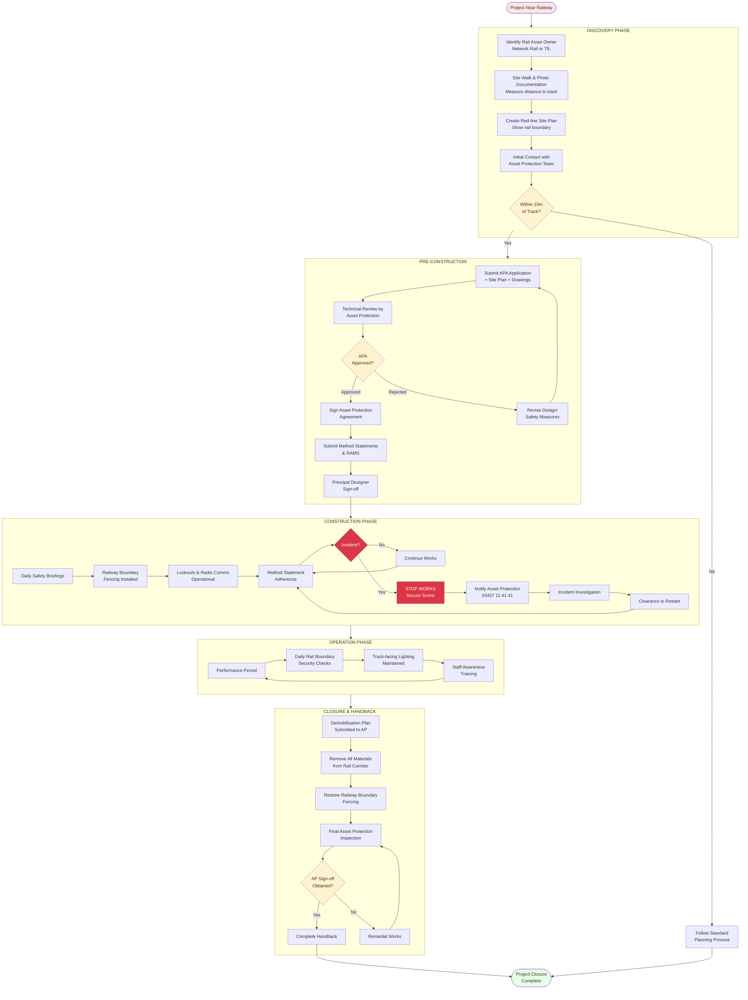

## Appendix 13.11 — Rail Safety Addendum (Operational)

**Critical Context: Railway Safety is Non-Negotiable**

This addendum provides the practical, step-by-step approach you **must** use when your site is adjacent to or near operational railway infrastructure (including Brunel Road trackside). It is intended to be used in conjunction with the Asset Protection / APA process described in Network Rail guidance and serves as an operational reference for your contractor and Principal Designer.

**Failure to comply with these requirements can result in:**
- Project shutdown by Network Rail/TfL
- Criminal prosecution under railway safety legislation
- Catastrophic safety incidents
- Permanent ban from working near railway infrastructure

**Integration Points:**
- Use with [Daily H&S Checklist (13.9)](#appendix-13-9-health-safety)
- Cross-reference with [Risk Register (13.5)](#appendix-13-5-risk-assessment)
- Feed findings into [Funder Reports (13.8)](#appendix-13-8-funder-report)
- Inform [Closure Handback (13.10)](#appendix-13-10-closure-handback)

**Rail Safety Process Flow - Discovery Through Operation**

**Critical Control Points:**

| Phase | Critical Decision | Authority | Consequence of Non-Compliance |
|:------|:------------------|:----------|:------------------------------|
| **Discovery** | Within 10m of track? | Site survey + OS maps | Proceeding without APA = criminal offence |
| **Pre-Construction** | APA approved? | Network Rail/TfL Asset Protection | Cannot commence any works without approval |
| **Construction** | Incident occurs? | Site Manager + Asset Protection | Immediate stop work; potential prosecution |
| **Operation** | Daily boundary checks? | Site Manager | Risk of trespass; safety incident |
| **Closure** | AP sign-off obtained? | Asset Protection Inspector | Cannot complete handback; deposit withheld |

**Emergency Contact (All Phases):**  
☎️ **Network Rail Asset Protection:** 03457 11 41 41 (24/7)  
☎️ **Signaller (if track incident):** Via Asset Protection or 999

**Timeline Expectations:**
- Initial AP response: 5-10 working days
- APA technical review: 6-12 weeks  
- Method statement approval: 2-4 weeks
- Incident investigation: 24-48 hours minimum before restart clearance

    <h3>RAIL SAFETY CHECK</h3>
    
**Distance to Track:** [___ meters]
**Asset Protection Contact:** [_________________]
**APA Status:** [Not Started / In Progress / Signed]

    <textarea id="specialist-rail-safety-railsafetycheck" class="user-note" placeholder="Type your notes here... (Auto-saved)"></textarea>

---

### 1. Immediate Steps (Discovery Phase)
- Identify the rail asset owner (Network Rail or TfL) and log the asset id and map reference.
- Conduct a site walk with photographs establishing the rail boundary and distance to live lines; create a red-line site plan showing any interfaces with track infrastructure.
- Contact Asset Protection and request initial guidance; record the Asset Protection contact details and ticket number.

2. Documents you must have before any works near track are permitted
- Site plan showing existing and proposed works (CAD / pdf)
- Temporary works drawings (scaffold, platforms, gantries) and structural calculations signed by a Chartered Structural Engineer
- Method Statements and the specific RAMS for works near the live line
- Construction Phase Plan and Health & Safety File (CDM) for contractors
- Proof of contractor competence: training, accreditation, and insurance (indemnity and public liability)
- Communication plan showing shift handovers, lookouts, and safe access routes
- Signing/lighting plan for any works requiring night operations near the line

3. Asset Protection Agreement (APA) and timelines
- Early engagement: contact Network Rail/TfL as soon as Discovery confirms proximity to track (Week 1)
- Initial technical call: 2–6 weeks to receive guidance and an initial site meeting request
- APA drafting/negotiation: typical duration 6–12 weeks depending on complexity; factor into your critical path
- APA approvals: attach copies to pre-construction information and supply to Principal Designer and Principal Contractor

4. Typical protective measures required by the rail asset owner
- Fencing and exclusion zones (temporary palisade or Heras with buttresses)
- Skeletal protection (catch-fencing or sacrificial sheeting) for dropped objects
- Temporary access routes with separation from track (signage and secure gates)
- Trained lookouts for works adjacent to live lines and contractor-specific safety briefings
- Protection of temporary cabling and servicing to prevent trespass or track contamination

8. H&S Monitoring schedule (rail-adjacent enhancements)
- Daily: site manager completes the daily H&S checklist (Appendix 13.9) with additional check: fencing integrity at rail boundary, lookouts in place, and radio comms tested.
- Weekly: Principal Contractor runs a weekly site safety inspection, documents any non-conformances, and updates the H&S file.
- Monthly: Monthly review by the client/Producer of all incidents and the risk register; update Asset Protection liaison point.
- Post-incident: Immediate suspension and formal post-incident review by the Principal Designer, H&S lead and Asset Protection before restart.

5. Example Incident Protocol (rail adjacent)
- Immediately stop works and secure area; confirm safety of any person involved
- Call Network Rail emergency number for asset incidents and follow the Asset Protection guidance
- Activate the site Emergency Action Plan including first-aider and site manager confirmation
- Record incident, collect witness statements, and keep the area preserved for asset inspection

6. Who signs-off what and when
- Principal Designer to review all temporary works and sign RAMS pre-construction
- Principal Contractor as lead on site safety; responsible for daily RAMS adherence
- Asset Protection: final sign-off (in writing) before any intrusive works

7. Sample 'Asset Protection' enquiry template (discover step)
> Dear [Asset Protection Team],
>
> We are planning a temporary venue at [Site Name and Address] which sits adjacent to Network Rail/TfL infrastructure. We request an initial technical meeting to discuss required asset protection, APA timelines, and any constraints on delivery (e.g., possessions, times for deliveries at night). Please find attached a site plan, photos, and a proposed scope of works.
>
> Contact: [Name, role, phone, email]
>
> Please confirm the preferred next steps and any fee or APA process requirements.

See the site toolkit for downloadable templates: `toolkit/apa-enquiry-template-full.md` and `toolkit/apa-clause-sample.md`.

---

