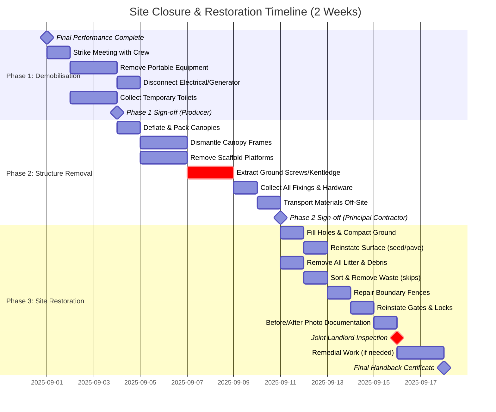
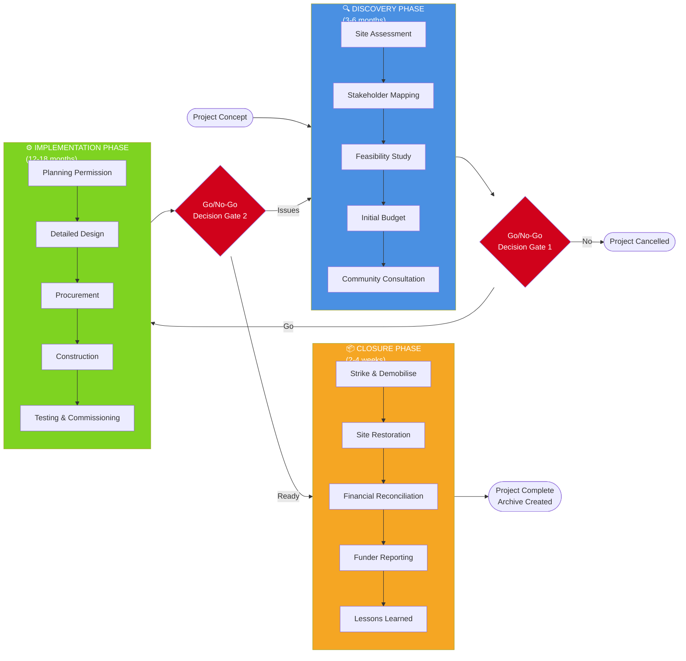
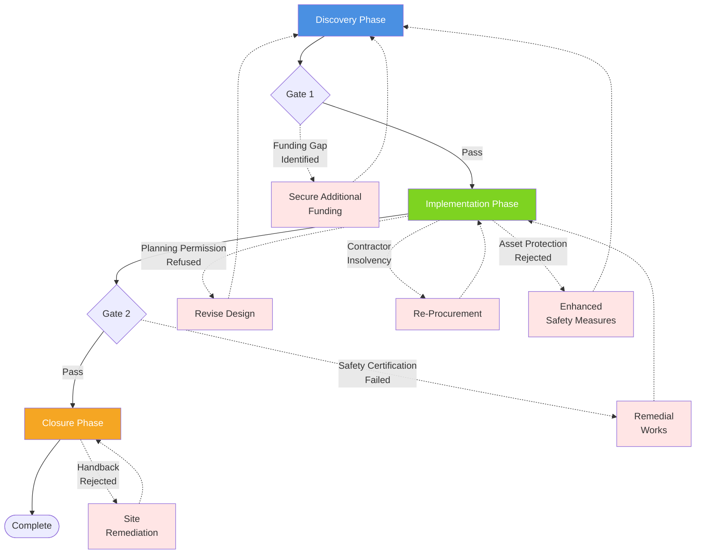

### 13.10 Closure and Handback Checklist

**The Golden Thread: Ending Well Secures Future Opportunities**

**[GOOD PRACTICE]**
How you leave a site matters as much as how you arrive. A professional, complete handback:
- Protects your reputation for future projects
- Secures your deposit/financial guarantee
- Maintains relationships with landowners and regulators
- Provides evidence for funder reporting
- Demonstrates environmental responsibility

**Success Indicator:** Handback certificate issued without remedial work requests and positive feedback from landowner.

**Integration Point:** Cross-reference with [Discovery Phase site photos](#discovery-phase), [Risk Register final version](#appendix-13-5-risk-assessment), and [Funder Report Section 4](#appendix-13-8-funder-report).

---

#### Template 13: Site Restoration and Handback Checklist

**Site Demount & Handback Process Flow**

**Critical Path Activities** (delays to these impact handback date):
- Ground screw extraction (specialist equipment required)
- Surface reinstatement (weather-dependent)
- Landlord inspection scheduling (requires 1 week notice)

**Sign-off Requirements:**

| Phase | Sign-off Required | Documents Needed | Approval Criteria |
|:------|:------------------|:-----------------|:------------------|
| **Phase 1 Complete** | Producer | Equipment inventory reconciliation Services disconnection certificates | All removable items off-site No utilities active |
| **Phase 2 Complete** | Principal Contractor | Structural removal completion cert Waste transfer notes Transport manifests | All installed works removed Materials accounted for |
| **Phase 3 Complete** | Landlord (TfL/Network Rail/Other) | Before/after photos Environmental check report Boundary restoration evidence | Site restored to original condition No contamination All access returned |

**Contingency Planning:**
- Weather delays: Build 3-day buffer into Week 2
- Inspection rejection: Pre-arrange contractor availability for remedial work
- Waste disposal: Book skip collection with 48hr flexibility

**Project Details:**

- Project name: ________  
- Completion date: ________

##### Phase 1 – Demobilisation (week 1)
- [ ] Final performance completed (date ________)
- [ ] Strike meeting held with all crew
- [ ] Equipment inventory reconciled
- [ ] Portable kit removed (lighting, sound, furniture, props)
- [ ] Electrical supply isolated / generator removed or powered down safely
- [ ] Temporary services disconnected (toilets serviced and collected)

##### Phase 2 – Structure removal (weeks 1–2)
- [ ] Canopies deflated/packed
- [ ] Canopy frames disassembled
- [ ] Scaffold platforms dismantled and components sorted
- [ ] Foundations removed (ground screws extracted or kentledge lifted)
- [ ] All fixings and hardware collected
- [ ] Materials transported off-site

##### Phase 3 – Site restoration (week 2)
- [ ] Holes filled and compacted
- [ ] Surface reinstated (re-seeded, re-paved, or equivalent)
- [ ] Litter/debris removed; all areas swept clean
- [ ] Waste sorted (recyclable / general / hazardous) with skips booked
- [ ] Waste transfer notes obtained
- [ ] Boundary fences repaired; bollards/signage reinstated
- [ ] Gates returned to original condition; landlord locks reinstated

##### Phase 4 – Environmental checks
- [ ] No evidence of fuel or material contamination
- [ ] Drainage inspected; gullies clear
- [ ] Trees/vegetation undamaged
- [ ] Ground compaction relieved (aerate/topsoil as required)

##### Phase 5 – Documentation
- [ ] “Before” photos retrieved from Discovery phase
- [ ] “After” photos captured and filed
- [ ] Comparison sheet prepared for funders/landlord
- [ ] Statutory inspection records collated (scaffold, H&S)
- [ ] Utility disconnections confirmed in writing
- [ ] All keys/access fobs returned
- [ ] Final waste disposal records filed

##### Phase 6 – Landlord inspection
- [ ] TfL/landowner notified (minimum one week’s notice)
- [ ] Joint inspection conducted (date ________, attendees ________)
- [ ] Deficiencies documented with action plan
- [ ] Remedial works completed and re-inspected if needed
- [ ] Handback certificate or written confirmation received and filed

##### Phase 7 – Final administration
- [ ] Final contractor invoices paid
- [ ] Utility accounts closed
- [ ] Insurance policy updated or cancelled
- [ ] Financial reconciliation completed
- [ ] Funder reports drafted/submitted
- [ ] Thank-you notes issued to partners
- [ ] Internal lessons-learned session completed
- [ ] Digital archive created and backed up; physical materials stored or donated
- [ ] Board notified of successful closure

##### Certification
I confirm that the site has been restored to the required standard and all handback requirements have been met.

- Site Manager: __________________  Date: ________
- Producer: ______________________  Date: ________
- Landlord representative (TfL Property / Network Rail / Other): __________________  Date: ________

Comments:  
____________________________________________________  
____________________________________________________

Final status: □ Site successfully handed back

Outstanding items (if any):  
____________________________________________________

---

## Conclusion

### Final Thoughts for the Theatre Director

**You've Reached the End—But This Is Just the Beginning**

**[INFERRED JUDGEMENT]**
If you've read this far, you now possess something rare: a comprehensive understanding of what it truly takes to create a theatre venue in one of the UK's most challenging urban environments. This knowledge transforms aspiration into achievable reality.

**The Eight Pillars of Success**

Creating a temporary theatre project—especially on challenging sites like railway-adjacent land—requires mastery of eight interconnected disciplines:

1. **Rigorous planning** – no shortcuts; every permission, every survey, every stakeholder matters.
2. **Patience** – regulatory processes take longer than you hope; build buffers.
3. **Flexibility** – you'll face surprises; adapt without compromising safety or vision.
4. **Partnerships** – no one succeeds alone; invest in relationships.
5. **Financial realism** – costs always exceed first estimates; model conservatively.
6. **Community focus** – this is for Rotherhithe; keep local benefit at the centre.
7. **Professional support** – hire experts (engineers, lawyers, consultants); it's false economy to DIY everything.
8. **Artistic courage** – don't lose sight of why you're doing this; let creativity lead.

### Partnerships and Practical Local Engagement
**[GOOD PRACTICE]**
Forming practical, local partnerships is a high-leverage activity: it reduces cost, builds audience and trust, and creates operational resilience. Use Appendix 13.19 (Collaborations & Partnerships Playbook) and Appendix 13.20 (Procurement) during Discovery to map partners, create quick MoUs, and as evidence of community support for funders.

### Your Project is Viable If:
- You have 18-24 months lead time (12 months minimum for Brunel Road; 36+ months for Pumphouse).
- You can secure £100k-£150k for the Brunel Road temporary project (or £2m-£4m for the Pumphouse permanent venue).
- You have strong artistic vision that responds to site constraints.
- You're willing to engage the community authentically (not just consultation box-ticking).
- You can build a skilled, committed team (even if small).
- You have organisational resilience (CIC structure, competent governance).

### Your Project is Not Viable If:
- You're in a hurry (these things cannot be rushed).
- You're unwilling to invest in professional advice.
- You see the community as an obstacle rather than a partner.
- You lack a funding pipeline (grants take 6-12 months; you need bridge funding).
- You cannot comply with safety requirements (non-negotiable near railway).

### Next Steps After Reading This Manual

#### If pursuing Brunel Road:
1. Land Registry search (Week 1).
2. Contact TfL Property and Network Rail (Week 1).
3. Site reconnaissance (Week 2).
4. Southwark pre-app enquiry (Weeks 3-4).
5. Decision point: proceed to Discovery Phase? (Week 6).

Refer to Appendix 13.14 (Director's 30/90 Day Action Playbook) and Appendix 13.11 (Rail Safety Addendum) for immediate tasks and templates.

**Brunel Road: Immediate rail-safety tasks (first 6 weeks)**
- Confirm the rail boundary and map references with Network Rail Asset Protection.
- Commission a GPR and structural survey before intrusive groundworks (Week 2–4).
- Appoint Principal Designer with rail experience; ensure Asset Protection is engaged prior to any temporary works (Week 3–5).

#### If pursuing Pumphouse:
1. Identify building owner; initiate contact (Week 1).
2. Commission building surveys (Months 1-2).
3. Community consultation (Month 2).
4. Feasibility study (capital costs, operating model) (Months 2-3).
5. Decision point: proceed to capital fundraising? (Month 4).

#### If pursuing Brunel Shaft:
1. Approach Brunel Museum (Week 1).
2. MoU negotiation (Month 1).
3. Programming and business case (Month 2).
4. Decision point: pilot season or full commitment? (Month 3).

### Resources and Support

**Strategic Partnerships: Your Extended Team**

The organisations listed below are not just service providers—they are potential partners in your project's success. Building relationships with sector bodies, funders, and professional networks creates resilience and opens doors to knowledge, funding, and collaborative opportunities.

**Resource & Support Ecosystem Map**

```mermaid
graph TD
    Project[YOUR THEATRE<br/>PROJECT] 
    
    %% Funding Cluster
    Project -->|£ Grants| ACE[Arts Council<br/>England]
    Project -->|£ Capital| NLHF[National Lottery<br/>Heritage Fund]
    Project -->|£ Development| AHF[Architectural<br/>Heritage Fund]
    Project -->|£ Local| Southwark[Southwark<br/>Cultural Grants]
    Project -->|£ Community| Crowdfund[Community<br/>Shares/Crowdfunding]
    
    %% Regulatory Cluster
    Project -->|⚖️ Permissions| Planning[Southwark<br/>Planning]
    Project -->|⚖️ Building| BC[Building<br/>Control]
    Project -->|⚖️ Rail Safety| NR[Network Rail<br/>Asset Protection]
    Project -->|⚖️ Land| TfL[TfL<br/>Property]
    Project -->|⚖️ Licensing| License[Licensing<br/>Authority]
    Project -->|⚖️ H&S| HSE[Health &<br/>Safety Executive]
    
    %% Professional Network Cluster
    Project -->|🤝 Advocacy| ITC[Independent<br/>Theatre Council]
    Project -->|🤝 Buildings| Trust[Theatres<br/>Trust]
    Project -->|🤝 Sector| SOLT[SOLT /<br/>UK Theatre]
    Project -->|🤝 Design| RIBA[RIBA /<br/>Architects]
    Project -->|🤝 Engineering| IStructE[IStructE /<br/>Engineers]
    Project -->|🤝 Legal| Lawyers[Charity Law<br/>Specialists]
    
    %% Community Cluster
    Project -->|👥 Partnership| RothForum[Rotherhithe<br/>Forum]
    Project -->|👥 Heritage| Brunel[Brunel<br/>Museum]
    Project -->|👥 Business| LocalBiz[Local<br/>Businesses]
    Project -->|👥 Volunteers| Volunteers[Volunteer<br/>Groups]
    Project -->|👥 Media| LocalPress[Local<br/>Press/Media]
    
    %% Reciprocal relationships
    ACE -.-> ITC
    NLHF -.-> Trust
    Trust -.-> RIBA
    RothForum -.-> Southwark
    Brunel -.-> NLHF
    LocalBiz -.-> RothForum
    
    style Project fill:#FF6B6B,stroke:#C92A2A,color:#fff
    style ACE fill:#4DABF7,stroke:#1971C2
    style NLHF fill:#4DABF7,stroke:#1971C2
    style AHF fill:#4DABF7,stroke:#1971C2
    style Southwark fill:#4DABF7,stroke:#1971C2
    style Crowdfund fill:#4DABF7,stroke:#1971C2
    style Planning fill:#FFA94D,stroke:#E8590C
    style BC fill:#FFA94D,stroke:#E8590C
    style NR fill:#FFA94D,stroke:#E8590C
    style TfL fill:#FFA94D,stroke:#E8590C
    style License fill:#FFA94D,stroke:#E8590C
    style HSE fill:#FFA94D,stroke:#E8590C
    style ITC fill:#69DB7C,stroke:#2F9E44
    style Trust fill:#69DB7C,stroke:#2F9E44
    style SOLT fill:#69DB7C,stroke:#2F9E44
    style RIBA fill:#69DB7C,stroke:#2F9E44
    style IStructE fill:#69DB7C,stroke:#2F9E44
    style Lawyers fill:#69DB7C,stroke:#2F9E44
    style RothForum fill:#DA77F2,stroke:#9C36B5
    style Brunel fill:#DA77F2,stroke:#9C36B5
    style LocalBiz fill:#DA77F2,stroke:#9C36B5
    style Volunteers fill:#DA77F2,stroke:#9C36B5
    style LocalPress fill:#DA77F2,stroke:#9C36B5
```

**Ecosystem Leverage Strategies:**

**🔵 Funding Bodies (Blue)** - Layer multiple small grants rather than depending on one large funder  
**🟠 Regulatory Bodies (Orange)** - Engage early; they can become advocates when properly consulted  
**🟢 Professional Networks (Green)** - Membership provides templates, advice lines, and peer learning  
**🟪 Community Partners (Purple)** - Co-creation builds authenticity and reduces costs through in-kind support

**Network Effects:**  
Dotted lines show mutual relationships between ecosystem members. Example: Arts Council trusts ITC recommendations; Brunel Museum has NLHF credibility; Local businesses influence Rotherhithe Forum. Build relationships strategically to leverage these connections.\n

**How to Use This Section:**

**For Immediate Needs:** Jump to the Quick-Reference Matrix at the bottom for contact details organized by function.

**For Strategic Planning:** Review each category to identify potential partnerships, not just transactional relationships.

**For Funding Strategy:** Note which funders support which project aspects, and layer multiple small grants rather than relying on a single large one.

---

### Funding Bodies by Project Phase

**Discovery Phase Funding (Feasibility Studies, Surveys, Consultancy):**
- Arts Council England: Project Grants (can include development costs)
- Architectural Heritage Fund: Project Development Grants (£5k-£25k for heritage buildings)
- Local trust funds: Many support feasibility work; search [Directory of Social Change](https://www.dsc.org.uk)

**Implementation Phase Funding (Capital Costs):**
- National Lottery Heritage Fund: Heritage Capital Grants (£10k-£5m)
- Arts Council England: Capital Grants
- Section 106 Developer Contributions: Via local authority
- Community share offers: [communityshares.org.uk](https://communityshares.org.uk)

**Operational Phase Funding (Running Costs, Programming):**
- Arts Council England: National Portfolio Organisation status or Project Grants
- Southwark Cultural Grants: [culture@southwark.gov.uk](mailto:culture@southwark.gov.uk)
- Earned income: Box office, café/bar, space hire
- Sponsorship and philanthropy

**Cross-Reference:** For funder reporting requirements, see [Appendix 13.8](#appendix-13-8-funder-report). For budget planning including funding mix, see [Appendix 13.18](#appendix-13-18).

---

| Organisation | Focus | Link / Notes |
| :--- | :--- | :--- |
| Arts Council England | Funding guidance, toolkits, policy insight | [artscouncil.org.uk](https://www.artscouncil.org.uk) |
| Independent Theatre Council | Contracts, advice line, pay guidance | [itc-arts.org](https://www.itc-arts.org) |
| Theatres Trust | Theatre buildings expertise, planning support | [theatrestrust.org.uk](https://www.theatrestrust.org.uk) |
| National Lottery Heritage Fund | Capital funding for heritage-led projects | [heritagefund.org.uk](https://www.heritagefund.org.uk) |
| Architectural Heritage Fund | Loans and grants for heritage assets | [ahfund.org.uk](https://ahfund.org.uk) |
| Network Rail Asset Protection | Safety approvals for working near live railway | [networkrail.co.uk](https://www.networkrail.co.uk/running-the-railway/looking-after-the-railway/asset-protection-and-optimisation/) |
| Southwark Council | Planning, licensing, culture grants | [southwark.gov.uk](https://www.southwark.gov.uk) |
| Society of London Theatre (SOLT) | Sector advocacy, ticketing schemes | [solt.co.uk](https://solt.co.uk) |
| UK Theatre | UK-wide professional network and training | [uktheatre.org](https://www.uktheatre.org) |
| Performing Arts Venue Network | Peer learning and benchmarking | Contact via SOLT/UK Theatre member services |

`[Diagram: stakeholder ecosystem map linking funders, regulators, partners, and networks — simple radial map showing core partners; replace with final graphic once design tooling is available]`

Pair this overview with the matrix in [Useful Contacts and Resources](#useful-contacts) and the evidence prompts in [Appendix 13.8](#appendix-13-8-funder-report) when preparing outreach or reporting packs.

## About the Project Delivery Framework

**The Foundation: Why Structure Enables Creativity**

This manual is grounded in professional project management methodology, specifically the **three-phase project lifecycle**: **Discovery → Implementation → Closure**. This framework, developed over decades of practice in construction, engineering, and programme delivery, provides the structural foundation that allows artistic vision to flourish safely and sustainably.

**Key Decision Gate Criteria:**
- **Gate 1 (Discovery → Implementation):** Planning permission likely? Budget secured? Community support? Board approval?
- **Gate 2 (Implementation → Closure):** All permits obtained? Construction complete? Safety certified? Ready to open?

**The Framework Delivers:**

**✔ Clear Phase Boundaries** — Defined decision points prevent premature commitment and costly reversals.
**✔ Defined Success Criteria** — Each phase has explicit objectives and measurable outputs.
**✔ Risk Management Integration** — Identify risks early, monitor throughout, document lessons at closure.
**✔ Stakeholder Engagement Cadence** — Structured touchpoints ensure no voice is overlooked.
**✔ Financial Control** — Spending gates prevent runaway costs and enable informed investment.
**✔ Audit Trail** — Documentation at each phase supports funder reporting and organisational learning.

---

### Why This Matters for Theatre Projects

**Bridging Artistic Process and Delivery Rigour**

**Epistemic Note:** The following analysis is derived from common failure modes observed in UK cultural infrastructure projects (2015-2025).

Theatre-makers often approach projects with artistic flexibility: "Let's start rehearsing and see what emerges." This works beautifully for devised performance but can be disastrous for venue development.

Building a venue—even a temporary one—involves:
- Legal permissions that take months and cannot be rushed
- Financial commitments that cannot be easily reversed
- Safety obligations that are non-negotiable
- Multiple stakeholders whose trust, once lost, is hard to regain

The project lifecycle provides discipline without stifling creativity. It asks you to pause at key moments (end of Discovery, before major spend in Implementation) and consciously decide: "Do we have enough information? Are we ready? Should we proceed?"

**Decision Gate Evaluation Matrix**

**[GOOD PRACTICE]**
This matrix is derived from standard project governance frameworks (PRINCE2, APM) adapted for cultural infrastructure.

| Criterion | Gate 1: Discovery → Implementation | Gate 2: Implementation → Closure | Weight |
|:----------|:-----------------------------------|:---------------------------------|:------:|
| **💰 Financial** | Budget confirmed for Implementation phase? Funding pipeline for operations? Contingency adequate (15%+)? | Final costs within ±10% of budget? Operational funding secured? Funder reporting complete? | 25% |
| **⚖️ Technical/Legal** | Planning permission achievable? Asset Protection engaged? Structural design feasible? | Building Control sign-off obtained? All permits & licences issued? APA compliance certified? | 25% |
| **👥 Community** | Community consultation complete? Support demonstrated (letters, partners)? Opposition manageable? | Local partnerships activated? Audience engagement plan live? Community benefits delivered? | 20% |
| **⚠️ Risk** | Top 5 risks have mitigation plans? Fatal flaws identified and resolved? Risk score acceptable (<15)? | Safety systems tested? Emergency procedures in place? Insurance valid and sufficient? | 15% |
| **🛠️ Resources** | Team/contractors identified? Key skills available? Timeline realistic? | Construction complete & certified? Operations team trained? Equipment commissioned? | 10% |
| **📋 Governance** | Board approval unanimous? Legal structure appropriate? Policies adopted (H&S, safeguarding)? | Handback certificate obtainable? Evaluation framework ready? Archive plan confirmed? | 5% |

**Traffic Light Decision Framework:**

- 🟢 **GREEN (Go):** All criteria met; proceed to next phase
- 🟡 **AMBER (Conditional):** Most criteria met; address gaps within 4 weeks before proceeding  
- 🔴 **RED (Stop):** Critical criteria unmet; pause or return to previous phase

**Minimum Threshold:** 80% of weighted criteria must be GREEN or AMBER to proceed.

---

### Alignment with Arts Council and Sector Practice

**[FROM INPUTS]**
Arts Council England increasingly expects funded organisations to demonstrate project management competence. ACE's own guidance references "project planning," "risk registers," and "evaluation frameworks"—all elements of the lifecycle approach.

Similarly, major construction funders (Heritage Lottery Fund, Architectural Heritage Fund) require:

- **Feasibility studies** (Discovery Phase)
- **Detailed business plans** (Implementation Phase – Planning)
- **Post-completion evaluations** (Closure Phase)

**Integration Benefit:** This manual integrates these expectations, so your project documentation serves multiple purposes:

1. **Internal management** – Clear roadmap for your team
2. **Funder reporting** – Meets compliance requirements efficiently
3. **Organisational learning** – Captures knowledge for future projects
4. **Stakeholder communication** – Demonstrates professionalism and accountability

**Cross-Reference Guide:**
- For funder reporting alignment, see [Appendix 13.8: Funder Report Template](#appendix-13-8-funder-report)
- For risk management integration, see [Appendix 13.5: Risk Assessment Framework](#appendix-13-5-risk-assessment)  
- For stakeholder engagement planning, see [Appendix 13.19: Partnerships Playbook](#appendix-13-19)
- For financial control, see [Appendix 13.18: Budget Sensitivity Analysis](#appendix-13-18)

---

### Flexibility Within Structure

**The Framework as Safety Rails, Not Straitjacket**

**[INFERRED JUDGEMENT]**
The lifecycle is not rigid. Projects may iterate—returning to Discovery if Implementation reveals fatal flaws, or extending Implementation if opening delays occur. But iteration must be:

✔ **Conscious** — Deliberate decision, not drift  
✔ **Documented** — Record why, what changed, implications  
✔ **Communicated** — Update stakeholders, funders, team

**Common Iteration Triggers & Actions:**

| Trigger Event | Phase Impact | Required Action | Typical Delay |
|:--------------|:-------------|:----------------|:-------------:|
| Planning permission refused | Implementation → Discovery | Design revision, re-consultation | 3-6 months |
| Contractor insolvency | Within Implementation | Re-tender, new contract | 6-12 weeks |
| Funding gap identified | Gate 1 pause | Additional applications, bridge funding | 3-9 months |
| Asset Protection rejected | Implementation → Discovery | Enhanced safety design | 2-4 months |
| Safety certification failed | Within Implementation | Remedial works, re-inspection | 2-6 weeks |
| Handback certificate withheld | Within Closure | Site remediation to specification | 1-3 weeks |

The structure provides **safety rails to prevent catastrophic mistakes**, not a straitjacket constraining creativity. Your artistic vision remains paramount; the lifecycle ensures that vision becomes reality rather than remaining mere aspiration.

**Next Step:** Ready to begin? Start with the [Quick Start Playbook](#quick-start-playbook) for immediate first-week actions, or continue reading for comprehensive phase-by-phase guidance.

---

