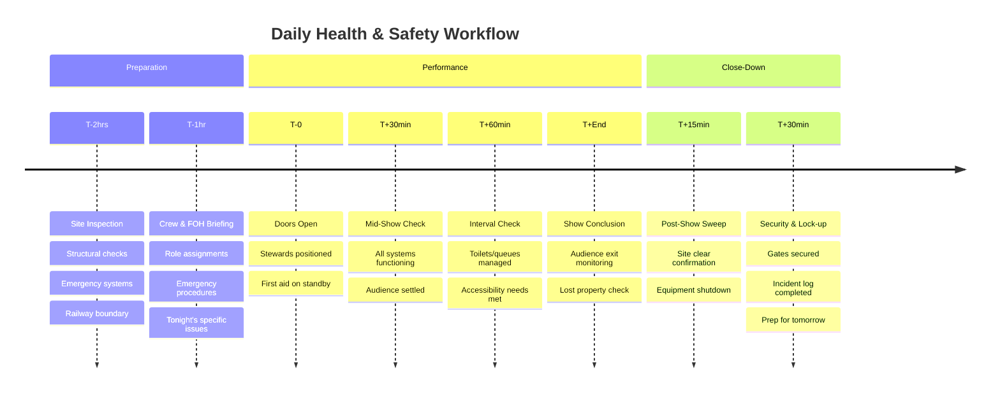

### 13.9 Health & Safety Checklist for Performance Days

**[GOVERNANCE NOTE: NON-NEGOTIABLE SAFETY]**
**Safety is the only thing that can close you down instantly.**
The Site Manager has absolute authority to stop the show if safety is compromised.
**Board Duty:** The Board must be assured that this checklist is being completed *daily*.

**The Golden Thread: Safety as Non-Negotiable Foundation**

Health and safety is not bureaucratic box-ticking—it is the ethical and legal foundation upon which everything else rests. For railway-adjacent sites, this becomes even more critical. The daily operational checklist below provides a systematic framework for maintaining safety standards throughout the performance run.

**Integration Point:** This checklist should be used in conjunction with the [Risk Register (Appendix 13.5)](#appendix-13-5-risk-assessment) and the [Rail Safety Addendum (Appendix 13.11)](#appendix-13-11). Daily observations feed into weekly risk reviews.

**Accountability:** The Site Manager owns daily checklist completion; the Producer reviews and escalates urgent issues; the Board receives weekly safety summaries.

---

#### Template 12: Daily Operational Checklist

**Daily site safety checklist – [Project Name]**

- Date: ________    Weather: ________    Performance: Yes / No  
- Completed by: ________    Time: ________

**Legend:** ☐ = complete, ✗ = issue (record action required)

**Visual Reference:**

**Daily H&S Timeline (Performance Day)**

**Checkpoint Responsibilities:**

| Time | Checkpoint | Responsible Person | Critical Checks | Documentation |
|:----:|:-----------|:-------------------|:----------------|:--------------|
| **T-2hrs** | Site Inspection | Site Manager | Structures, boundaries, emergency equipment | Daily Checklist (Sec. 1) |
| **T-1hr** | Crew Briefing | Producer + Site Manager | Roles, numbers, emergency contacts | Briefing Log (Sec. 2) |
| **T-0** | Doors Open | Front of House Lead | Capacity control, accessibility | Entry Log |
| **T+30min** | Mid-Show | Duty Manager | Operations smooth, no issues | Performance Notes |
| **T+60min** | Interval | FOH + Facilities | Queues, facilities, accessibility | Interval Report |
| **T+End** | Audience Exit | Stewards + FOH | Complete departure, belongings | Exit Confirmation |
| **T+30min** | Close Down | Site Manager | Equipment off, site secure | Close-Down Checklist (Sec. 3) |

**For railway-adjacent sites, add:**
- T-2hrs: Railway boundary fence integrity check
- T+End: Track-facing lights must remain on until site secured
- T+30min: Confirm no materials left within 3m of railway boundary

---

##### Site Inspection (2 Hours Before First Performance)

**Critical Focus:** Structural integrity, emergency systems, railway boundary security.

| Item | Check | Status | Action if Issue |
| :--- | :--- | :---: | :--- |
| Fencing and boundaries | Secure, no gaps, height adequate | ☐ | |
| Gates | Functioning locks, no obstructions | ☐ | |
| Walkways | Clear of trip hazards, cables covered | ☐ | |
| Platforms | Stable, no loose boards, guardrails intact | ☐ | |
| Canopies | Tensioned correctly, no tears or damage | ☐ | |
| Lighting | All fixtures working, no exposed wiring | ☐ | |
| Sound equipment | Tested, volume appropriate, no feedback | ☐ | |
| Emergency lighting | Tested, batteries charged | ☐ | |
| Emergency exits | Clear, signage visible and illuminated | ☐ | |
| Fire extinguishers | In position, pins intact, pressure OK | ☐ | |
| First aid kit | Stocked, accessible, location known to staff | ☐ | |
| Toilets | Clean, stocked, waste removed | ☐ | |
| Generator | Fuel adequate, running smoothly, secure | ☐ | |
| Weather check | Forecast reviewed; wind speeds < 40 mph | ☐ | |
| Railway boundary | Fencing intact; no evidence of tampering | ☐ | |

##### Crew and FOH briefing (1 hour before)

| Item | Check | Status | Notes |
| --- | --- | --- | --- |
| Stewards rostered | [Number] required / [Number] present | ☐ | |
| Hi-vis worn | All FOH staff identifiable | ☐ | |
| Briefing delivered | Roles, emergency procedures, nightly issues | ☐ | |
| First aider named | Name ________  Location ________ | ☐ | |
| Contact numbers shared | All staff have Site Manager mobile | ☐ | |
| Capacity reminder | Max audience 60; overspill protocol confirmed | ☐ | |

##### Performance monitoring (during show)

| Time | Check | Notes |
| --- | --- | --- |
| 30 min into show | All areas functioning; audience settled | |
| 60 min / interval | Toilets, queues, accessibility needs reviewed | |
| End of show | Audience exit clear; no belongings left | |

##### Post-show close down

| Item | Check | Status | Action |
| --- | --- | --- | --- |
| Audience departed | Site clear | ☐ | |
| Equipment shut down | Lights, sound, generator powered off/secured | ☐ | |
| Gates locked | Site secure overnight | ☐ | |
| Lost property logged | Items stored safely | ☐ | |
| Litter removed | Bins emptied if full | ☐ | |
| Prep for tomorrow | Outstanding tasks noted | ☐ | |

##### Incidents / near misses
Record accidents, injuries, near-misses, or audience complaints.  
Time: ________  Description: ______________________________  
Action taken: ______________________________  
Reported to: ________  Follow-up required: Yes / No

##### Weather / other notes
[Observations relevant to tomorrow’s operations]

##### If the incident involves the railway or critical rail asset (rail adjacent sites)
**[CRITICAL SAFETY PROTOCOL]**
- Immediately stop all works and secure the scene.
- Notify Network Rail Asset Protection and TfL Property immediately (see contact matrix for phone numbers).
- If there is any possibility of track or asset damage or tampering, inform the site control point and the emergency services per Network Rail guidance.
- Log the incident in the incident register and flag for immediate H&S review; do not re-open site activities until Asset Protection confirms it is safe.
- Example rapid contacts: Network Rail Asset Protection (03457 11 41 41), TfL Property (property@tfl.gov.uk).

____________________________________________________

##### Sign-off
- Checklist completed by: ________  Time: ________
- Site Manager review: ________  Time: ________
- Urgent issues requiring immediate attention? Yes / No  
   If yes, describe: __________________________________

See toolkit/hs-daily-checklist-print.md for a downloadable/printable H&S daily checklist.

---

