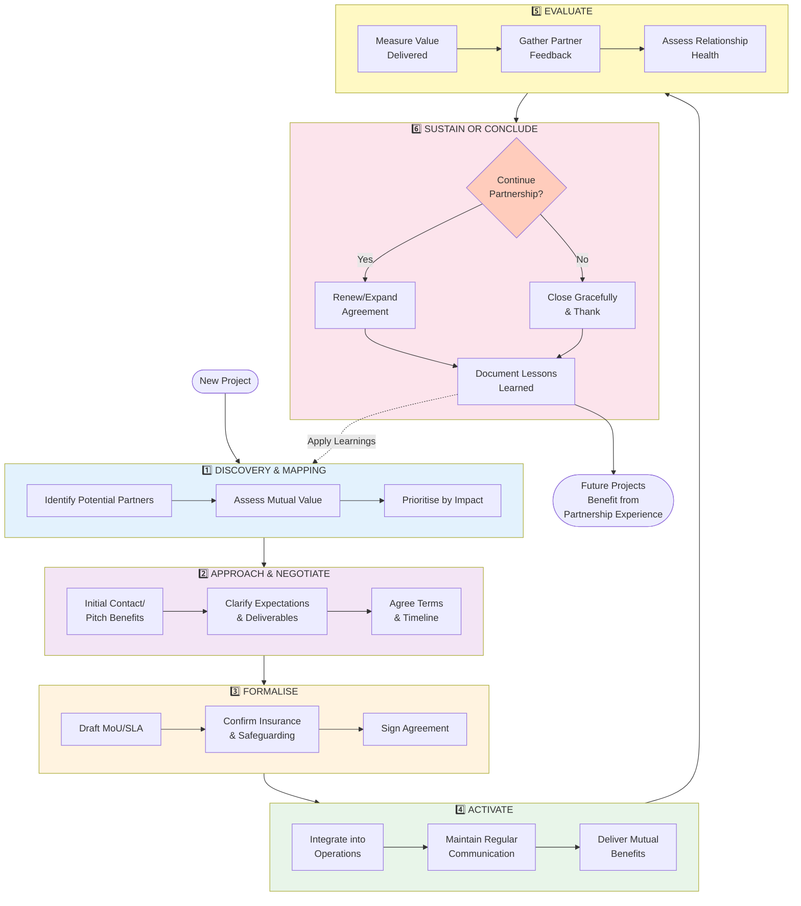

## Appendix 13.19 — Collaboration & Partnerships Playbook

**[GOVERNANCE NOTE: RELATIONAL CAPITAL]**
**Partnerships are not just logos on a website; they are operational assets.**
A signed MoU is worthless without a working relationship.
**Critical Success Factor:** Treat partners as investors, even if they invest time rather than money.

**The Strategic Value of Partnerships**

This playbook explains how partnerships with local businesses, community groups, service providers, and statutory bodies deliver practical value: cost reduction, in-kind support, marketing reach, audience development, and operational resilience. Embedded partnerships from Discovery phase onwards demonstrate to funders and stakeholders that your project is community-rooted, not imposed.

**Golden Thread:** Every £1 of in-kind partnership value reduces your cash funding requirement and demonstrates community support. Well-managed partnerships are the difference between marginal viability and strong sustainability.

**Partnership Lifecycle - Continuous Improvement Model**



**Stage-by-Stage Guidance:**

| Stage | Duration | Key Activities | Success Indicators | Common Pitfalls |
|:------|:--------:|:---------------|:-------------------|:----------------|
| **1. Discovery** | Week 1-2 | Stakeholder mapping; value assessment; prioritization matrix | 10-15 potential partners identified; clear value proposition for each | Approaching everyone; no prioritization |
| **2. Approach** | Week 2-4 | Initial pitch; expectations negotiation; terms discussion | Positive response from 60%+; clear mutual benefits articulated | One-sided ask; no clear benefit to partner |
| **3. Formalise** | Week 4-6 | MoU drafting; insurance/safeguarding checks; sign-off | Signed agreements; legal/compliance confirmed | Over-complicating; delaying with legal perfectionism |
| **4. Activate** | Month 2-12+ | Operational integration; regular communication; benefit delivery | Partner contributing as planned; communication flowing; issues resolved quickly | Neglect after sign-off; poor communication |
| **5. Evaluate** | Month 6, 12 | Value measurement; feedback gathering; relationship assessment | Quantified value delivered; positive feedback; issues identified and addressed | No evaluation; assuming all is well |
| **6. Sustain/Conclude** | Month 12+ | Renewal decision; expansion options; or graceful closure | Clear decision; lessons documented; relationship ends well or strengthens | Ghosting partners; abrupt endings |

**Value Measurement Framework:**

```
PARTNERSHIP VALUE SCORECARD
════════════════════════════════════════════

Financial Value:
  • In-kind contributions:        £_______
  • Cash sponsorship:             £_______
  • Cost savings realized:        £_______
  TOTAL FINANCIAL:                £_______

Non-Financial Value:
  • Volunteer hours (x £12/hr):   ___ hrs = £___
  • Marketing reach:              ___ people
  • Credibility enhancement:      🟢 🟡 ⚪ (rate)
  • Community trust building:     🟢 🟡 ⚪ (rate)
  • Skill/knowledge transfer:     🟢 🟡 ⚪ (rate)

Relationship Health:
  • Communication quality:        ⭐⭐⭐⭐⭐ (5-star)
  • Responsiveness:               ⭐⭐⭐⭐⭐ (5-star)
  • Mutual satisfaction:          ⭐⭐⭐⭐⭐ (5-star)

RECOMMENDATION:  ☐ Renew  ☐ Expand  ☐ Maintain  ☐ Conclude
```

**Continuous Improvement Loop:**  
Lessons from Stage 6 (Sustain/Conclude) feed back into Stage 1 (Discovery) for future projects, creating organizational learning about what makes partnerships successful.

**Integration Points:**
- Partnership values inform [Budget Model (13.18)](#appendix-13-18)
- Partnership evidence strengthens [Funder Applications](#appendix-13-8-funder-report)
- Community partners support [Accessibility Goals (13.13)](#appendix-13-13)
- Procurement partnerships covered in [Appendix 13.20](#appendix-13-20)


<div class="interactive-block">
    <h3>PARTNERSHIP TARGETS</h3>
    <p>1. [Partner Name] - [Value: £___]
2. [Partner Name] - [Value: £___]
3. [Partner Name] - [Value: £___]</p>
    <textarea id="toolkit-partnerships-playbook-partnershiptargets" class="user-note" placeholder="Type your notes here... (Auto-saved)"></textarea>
</div>


---

### When to Prioritise Partnerships
- Include partnerships from the earliest Discovery phase: funders and local stakeholders will judge the project favourably if partnerships are demonstrably embedded into the delivery model.

Types of collaborations and practical uses
1. Venue & Landowner Partnerships (TfL / Network Rail / Private Landlords)
- Why: land access, permissions, shared maintenance, and long-term land-use relationships.
- Practical value: reduced licence fees, joint PR, assistance with local stakeholders, help with access and coordination.
- What to ask: clarity on access times, asset protection constraints, liability, site restoration expectations (see Appendix 13.10 Handback Checklist).

2. Local Business Partnerships (cafés, pubs, market vendors)
- Why: operational support, in-kind services, cross-marketing and ticketing partnerships.
- Practical value: in-kind supplies, discounted catering, volunteer recruitment, advertising in local venues.
- Example offer: a mutually beneficial discount (e.g., 10% discount for patrons who show the event ticket) or in-kind sponsorship in return for visibility.

3. Community & Culture Partnerships (community centres, schools, Rotherhithe community groups)
- Why: Reach, consultation, programming co-creation and community buy-in.
- Practical value: local volunteers, community content, shared events and trust-building.
- What to formalise: a simple MoU or co-programming agreement clarifying roles, small financial arrangements, safeguarding expectations, and reciprocity.

4. Service Providers (e.g., Local Trades, H&S Consultants, Acoustics, Security, Box Office providers)
- Why: operational capability, specialist skill transfer, often quicker or cheaper than bringing external teams from farther afield.
- Practical value: improved procurement times, local knowledge, flexibility around site constraints.

5. Statutory & Non-statutory Partners (Southwark Council, TfL, Network Rail, Police)
- Why: approvals, supportive services, enforcement, and operational liaison for public safety.
- Practical value: smoother planning, quicker resolution of constraints, and essential safety oversight on rail-adjacent sites.

Partnership formation steps (pragmatic, standard process)
1) Discovery: map potential partners and value they could bring. Use a short spreadsheet with value categories (in-kind / financial / service / marketing).
2) Approach: prepare a two-paragraph approach message and an MoU template. Offer clear benefits to partners (e.g., 'co-created family event on 21-25 Jul, 2 hours per day, expected footfall 1,000').
3) Negotiate: clarify expectations, data sharing obligations, insurance, safeguarding and liability.
4) Formalise: sign a short MoU or SLA, depending on the complexity. Keep it simple for small partnerships; formal contracts for higher-value or ongoing support.
5) Activate: include partners in key pre-event briefings and coordination meetings; provide clear lines for communication during events.

### Partner Contact & Contribution Form (Quick Template)
- Partner organisation: [Name]
- Primary contact: [Name, role, phone, email]
- Type of partnership: [In-kind / Financial / Service / Marketing / Venue access]
- Contribution: [Specify items, hours, or financial support]
- Start and end dates: [DD/MM/YYYY – DD/MM/YYYY]
- Safeguarding requirements: [Yes/No – specify level of DBS and training required]
- Insurance & liability notes: [Confirm insurance type & policy number if applicable]
- Comments: [Additional details]
- Agreed by: [Name & Signature]

### Sample Partnership Log (for funder reporting)
| Partner | Contribution Type | Estimated Value | Notes | Signed MoU? |
|---|---|---:|---|---|
| Local Cafe Ltd | In-kind catering | £800 | 10 meals/day x 4 days | Yes |
| Rotherhithe Youth Centre | Volunteer ushers | 40 hrs | 4 volunteers x 10 hrs | No |
| Pub on Wharf | Sponsorship (marketing) | £500 in-kind | Poster space & social media share | Yes |


Sample MoU clauses (non-legal, high level)
- Purpose: "[Name] will provide X in-kind and Y services; the venue operator will provide Y visibility and Z access in return."
- Duration: Scale and start/end dates.
- Liability: Each party maintains insurance and will not hold the other liable for negligence.
- Safeguarding: where relevant, partner confirms DBS checks and safeguarding practices for staff/volunteers.
- Termination: Simple clause allowing termination for cause with 30 days’ notice.

Partnership management & maintenance
- Assign a named Partnership Lead (Producer/Community Lead) with a single contact for each partner.
- Monthly partner updates in the delivery phase (email) and a pre-event coordination call 2–3 weeks prior to opening.
- Review partner performance and community impact post-project (Appendix 13.17 evaluation template).

Measuring partnership value (practical metrics)
- In-kind value: estimate retail value for donated goods and services (e.g., catering, furniture, staging).
- Volunteer value: volunteer hours × local living wage rate for equivalent staff time.
- Marketing reach: estimated audience exposure (local footfall, social media reach; use simple percentage multipliers).
- Equity outcomes: number of local participants, number of local suppliers used.

Local procurement guidance
- Prioritise local SMEs where practical: write procurement sections with 'Buy Local' guidance for small items; record preferred supplier lists.
- Use proportionate contracting: use simple POs for small purchases; consider multiple quotes for items >£10k.
- Social value in procurement: include clauses that prioritize local job opportunities and environmental performance where practical.

Pitfalls and mitigations
- Misaligned expectations: set clear objectives and budgets; use the sample MoU to clarify deliverables.
- Reputation risk: vet partners for community standing and service delivery.
- Safeguarding & legal gaps: ensure any partner involved with children and vulnerable adults complies with safeguarding checks and DBS requirements.

Outreach templates (sample email)
> Subject: Partnership Opportunity — [Event name, dates]
>
> Dear [Name],
>
> I’m [Name], Producer for [Project]. We are creating a short-run temporary theatre in Rotherhithe on [dates]. We are interested in exploring partnership opportunities with local businesses/organisations and believe there may be mutual benefits, including increased footfall and profile.
>
> We would welcome a conversation at your convenience to discuss possible collaborations ranging from in-kind support to co-created events. I’ve attached a short summary (1 page) of the event and possible benefits for partners.
>
> Best regards,
> [Name and contact]

---

<a id="appendix-13-20"></a>
